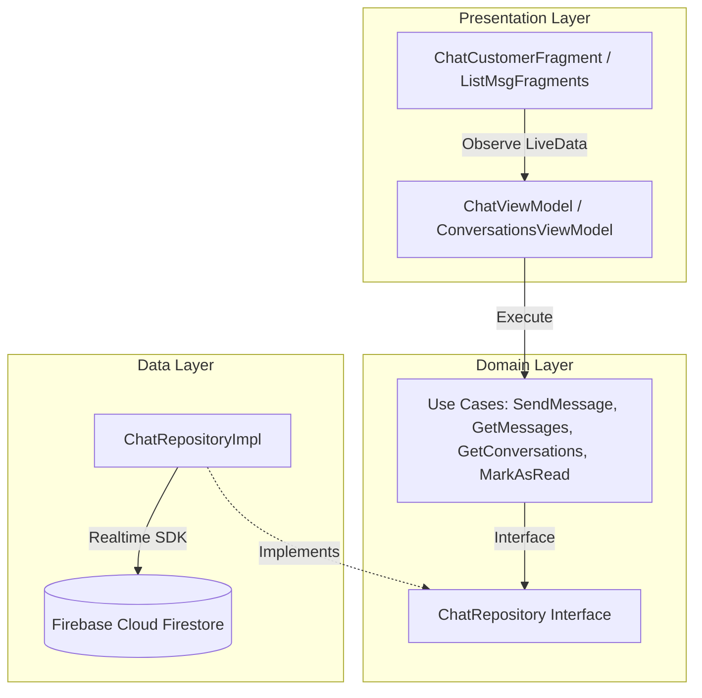

# Hướng Dẫn Tích Hợp Chức Năng Chat Bằng Firebase Firestore

Tài liệu này tổng hợp kiến trúc hệ thống, cấu trúc cơ sở dữ liệu Firestore, danh sách các file mã nguồn và hướng dẫn kiểm thử cho tính năng Chat thời gian thực (realtime 1-1 chat) giữa Khách hàng (Customer) và Thợ (Worker).

Dự án đã được đồng bộ cấu hình thành công:
- **Package Name / Application ID**: `com.fixit` (Đã đồng bộ giữa file `app/build.gradle` và file `google-services.json`).
- **Build Status**: Thành công (`BUILD SUCCESSFUL` với Gradle 9.4.1).

---

## Kiến Trúc Hệ Thống (Clean Architecture & MVVM)

Để đảm bảo khả năng mở rộng, bảo trì và dễ dàng test, chức năng chat được thiết kế theo mô hình Clean Architecture kết hợp MVVM:



---

## Thiết Kế Cơ Sở Dữ Liệu Firestore

Chúng ta sử dụng cấu trúc tài liệu (Document-based) phẳng kết hợp Subcollection của Firestore để quản lý hội thoại hiệu quả:

### 1. Collection `conversations` (Danh sách phòng chat chính)
Mỗi document tương ứng với cuộc hội thoại giữa 1 Khách hàng và 1 Thợ.
- **Document ID**: `{customerId}_{workerId}` (ví dụ: `cust001_work999`) để đảm bảo không bị tạo trùng lặp phòng.
- **Fields**:
  | Tên trường | Kiểu dữ liệu | Mô tả |
  | :--- | :--- | :--- |
  | `id` | String | Trùng với Document ID. |
  | `customerId` | String | ID của Khách hàng tham gia phòng chat. |
  | `workerId` | String | ID của Thợ tham gia phòng chat. |
  | `customerName` | String | Tên đầy đủ của Khách hàng (hiển thị cho Thợ xem). |
  | `workerName` | String | Tên đầy đủ của Thợ (hiển thị cho Khách hàng xem). |
  | `lastMessage` | String | Nội dung tin nhắn cuối cùng gửi trong phòng. |
  | `lastMessageTime`| Timestamp | Thời gian của tin nhắn cuối cùng (sử dụng Server Timestamp). |
  | `senderId` | String | ID của người gửi tin nhắn cuối cùng. |
  | `participants` | Array [String] | Danh sách ID tham gia `[customerId, workerId]` để tối ưu hóa việc truy vấn danh sách chat của mỗi user. |
  | `unreadFor` | Map [String, Boolean] | Trạng thái chưa đọc của từng user. Ví dụ: `{ "cust001": false, "work999": true }` |

### 2. Subcollection `messages` (Nằm dưới mỗi phòng chat)
Chứa toàn bộ lịch sử tin nhắn của phòng chat đó.
- **Path**: `/conversations/{conversationId}/messages/{messageId}`
- **Fields**:
  | Tên trường | Kiểu dữ liệu | Mô tả |
  | :--- | :--- | :--- |
  | `messageId` | String | ID tự sinh của tin nhắn. |
  | `senderId` | String | ID của người gửi tin nhắn. |
  | `receiverId` | String | ID của người nhận tin nhắn. |
  | `content` | String | Nội dung tin nhắn dạng văn bản. |
  | `timestamp` | Timestamp | Thời gian gửi tin nhắn (dùng sắp xếp danh sách theo thứ tự tăng dần). |

---

## Các Thành Phần Đã Triển Khai

> [!NOTE]
> Tất cả các thành phần bên dưới đã được cài đặt và compile thành công.

### 1. Thư viện & Cấu hình Build
- **[app/build.gradle](file:///d:/Project_FixItVNeeeeeee/android/app/build.gradle)**:
  - Áp dụng plugin: `id 'com.google.gms.google-services'`
  - Đồng bộ `applicationId "com.fixit"` trùng khớp với client ID trong file `google-services.json`.
  - Tích hợp thư viện Firebase BOM và Firestore SDK:
    ```groovy
    implementation platform('com.google.firebase:firebase-bom:34.13.0')
    implementation 'com.google.firebase:firebase-firestore'
    ```

### 2. Lớp Dữ Liệu (Data Layer)
- **[ChatRepositoryImpl.java](file:///d:/Project_FixItVNeeeeeee/android/app/src/main/java/com/fixit/feature/customer/chat/data/repository/ChatRepositoryImpl.java)**:
  - Quản lý đọc/ghi Firestore bằng `WriteBatch` để đảm bảo khi gửi tin nhắn mới, cả thông tin tin nhắn trong `messages` và tin nhắn cuối của `conversations` đều được cập nhật đồng thời.
  - Sử dụng `addSnapshotListener` lắng nghe thay đổi thời gian thực và tự động parse sang Model.

### 3. Lớp Nghiệp Vụ (Domain Layer)
- **[ChatRepository.java](file:///d:/Project_FixItVNeeeeeee/android/app/src/main/java/com/fixit/feature/customer/chat/domain/repository/ChatRepository.java)**: Interface trừu tượng hóa các phương thức chat.
- **Model**:
  - [ChatMessage.java](file:///d:/Project_FixItVNeeeeeee/android/app/src/main/java/com/fixit/feature/customer/chat/domain/model/ChatMessage.java) (Đại diện 1 tin nhắn).
  - [ChatPreview.java](file:///d:/Project_FixItVNeeeeeee/android/app/src/main/java/com/fixit/feature/customer/chat/domain/model/ChatPreview.java) (Đại diện 1 phòng chat trong danh sách).
- **Use Cases**:
  - [SendMessageUseCase.java](file:///d:/Project_FixItVNeeeeeee/android/app/src/main/java/com/fixit/feature/customer/chat/domain/usecase/SendMessageUseCase.java)
  - [GetMessagesUseCase.java](file:///d:/Project_FixItVNeeeeeee/android/app/src/main/java/com/fixit/feature/customer/chat/domain/usecase/GetMessagesUseCase.java)
  - [GetConversationsUseCase.java](file:///d:/Project_FixItVNeeeeeee/android/app/src/main/java/com/fixit/feature/customer/chat/domain/usecase/GetConversationsUseCase.java)
  - [MarkAsReadUseCase.java](file:///d:/Project_FixItVNeeeeeee/android/app/src/main/java/com/fixit/feature/customer/chat/domain/usecase/MarkAsReadUseCase.java)

### 4. Giao Diện (Presentation Layer)
- **ViewModels**:
  - [ChatViewModel.java](file:///d:/Project_FixItVNeeeeeee/android/app/src/main/java/com/fixit/feature/customer/chat/presentation/ChatViewModel.java): Quản lý gửi và nhận tin nhắn realtime của một phòng chat cụ thể. Tự động gọi hủy lắng nghe (`listenerRegistration.remove()`) khi hủy ViewModel để chống memory leak.
  - [ConversationsViewModel.java](file:///d:/Project_FixItVNeeeeeee/android/app/src/main/java/com/fixit/feature/customer/chat/presentation/ConversationsViewModel.java): Quản lý nạp danh sách các phòng chat hiện có của người dùng.
- **Fragments & Adapters**:
  - [ChatCustomerFragment.java](file:///d:/Project_FixItVNeeeeeee/android/app/src/main/java/com/fixit/feature/customer/chat/presentation/ChatCustomerFragment.java): Màn hình chat 1-1 với adapter [ChatMessageAdapter.java](file:///d:/Project_FixItVNeeeeeee/android/app/src/main/java/com/fixit/feature/customer/chat/presentation/ChatMessageAdapter.java).
  - [CustomerListMsgFragment.java](file:///d:/Project_FixItVNeeeeeee/android/app/src/main/java/com/fixit/feature/customer/chat/presentation/CustomerListMsgFragment.java): Màn hình danh sách chat phía Khách hàng.
  - [WorkerListMsgFragment.java](file:///d:/Project_FixItVNeeeeeee/android/app/src/main/java/com/fixit/feature/worker/chat/presentation/WorkerListMsgFragment.java): Màn hình danh sách chat phía Thợ.

---

## Kịch Bản Kiểm Thử & Xác Minh (Verification Plan)

> [!IMPORTANT]
> **Điều kiện tiên quyết trước khi kiểm thử:**
> Hãy chắc chắn bạn đã kích hoạt **Cloud Firestore** trên Firebase Console và thiết lập **Rules** cho phép đọc/ghi.
> ```javascript
> rules_version = '2';
> service cloud.firestore {
>   match /databases/{database}/documents {
>     match /{document=**} {
>       allow read, write: if true; // Chế độ Test hoặc phân quyền bảo mật phù hợp
>     }
>   }
> }
> ```

### Các bước kiểm thử thủ công:

1. **Khởi chạy ứng dụng**:
   - Chạy ứng dụng trên máy ảo/thiết bị thật Android.
2. **Đăng nhập**:
   - Đăng nhập tài khoản Khách hàng ở thiết bị A.
   - Đăng nhập tài khoản Thợ ở thiết bị B (hoặc dùng trình giả lập song song).
3. **Mở phòng chat**:
   - Từ màn hình danh sách Thợ của Khách hàng, chọn một Thợ và nhấn **Chat**.
   - Màn hình chat chi tiết sẽ mở ra. Lúc này trên Firebase Firestore, một Document mới trong collection `conversations` (với ID dạng `{customerId}_{workerId}`) sẽ tự động được khởi tạo ngay khi tin nhắn đầu tiên được gửi đi.
4. **Gửi tin nhắn thời gian thực**:
   - Nhập nội dung tin nhắn ở máy Khách hàng và bấm **Gửi**.
   - Kiểm tra xem tin nhắn có xuất hiện lập tức trên màn hình chat của Thợ hay không (không cần reload).
   - Phản hồi từ phía Thợ và kiểm tra xem Khách hàng có nhận được phản hồi ngay lập tức không.
5. **Kiểm tra trạng thái Chưa đọc (Unread Indicator)**:
   - Khi một bên gửi tin nhắn mới và bên kia đang ở màn hình ngoài (danh sách hội thoại):
     - Xác nhận có chấm thông báo tin nhắn chưa đọc (unread dot) hiển thị ở phòng chat đó.
     - Dòng chữ tin nhắn cuối cùng hiển thị dạng in đậm (Bold).
     - Khi bấm vào phòng chat để đọc tin nhắn, chấm thông báo phải biến mất và tin nhắn trở lại hiển thị bình thường.
