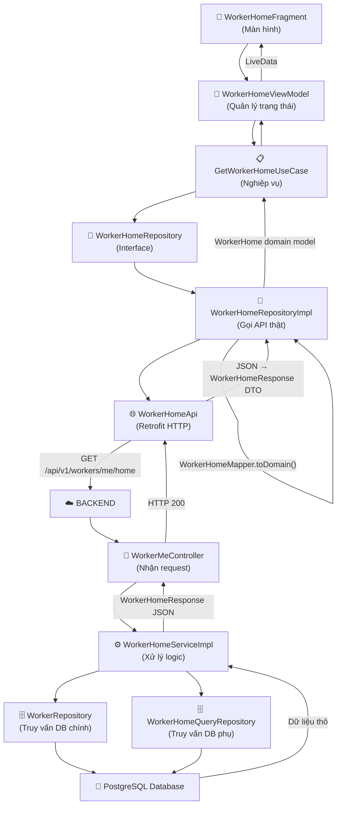

# Luồng thiết kế API `/api/v1/workers/me/home`

> Tài liệu giải thích toàn bộ hành trình dữ liệu từ khi app Android gọi API cho đến khi hiển thị lên màn hình, viết bằng ngôn ngữ tự nhiên dễ hiểu.

---

## Tổng quan luồng dữ liệu



---

## PHẦN 1: BACKEND (Spring Boot)

### Cấu trúc folder Backend

```
backend/src/main/java/com/fixit/domain/worker/
├── controller/          ← Nhận request HTTP từ client
│   └── WorkerMeController.java
├── service/             ← Xử lý logic nghiệp vụ
│   ├── WorkerHomeService.java        (interface)
│   └── WorkerHomeServiceImpl.java    (implementation)
├── repository/          ← Truy vấn database
│   ├── WorkerRepository.java         (query tổng hợp dashboard)
│   ├── query/
│   │   └── WorkerHomeQueryRepository.java  (các query chi tiết)
│   └── projection/      ← Định nghĩa "hình dạng" dữ liệu trả về từ DB
│       ├── WorkerDashboardSummaryProjection.java
│       ├── WorkerActiveBookingProjection.java
│       ├── WorkerPerformanceStatsProjection.java
│       ├── WorkerIncomeChartPointProjection.java
│       └── WorkerScheduleItemProjection.java
├── dto/response/        ← Cấu trúc JSON trả về cho client
│   └── WorkerHomeResponse.java
├── mapper/              ← Chuyển đổi dữ liệu giữa các lớp
│   └── WorkerHomeMapper.java
├── support/             ← Tiện ích hỗ trợ
│   └── CurrentWorkerResolver.java
└── entity/              ← Đại diện bảng trong database
    └── Worker.java
```

---

### Bước 1: Nhận Request — `controller/`

**File:** [WorkerMeController.java](file:///f:/Project_personal/FixItVN/backend/src/main/java/com/fixit/domain/worker/controller/WorkerMeController.java)

**Vai trò folder `controller/`:** Đây là "cửa trước" của backend. Nó nhận mọi request HTTP từ bên ngoài (app Android, Postman...) và chuyển tiếp xuống tầng service xử lý.

**Cách hoạt động:**
- Annotation `@GetMapping("/home")` nói rằng: "Khi ai đó gửi request `GET` tới `/api/v1/workers/me/home`, hãy chạy hàm `getHome()`"
- Hàm `getHome()` chỉ làm 1 việc duy nhất: gọi `workerHomeService.getHome()` rồi bọc kết quả vào `ApiResponse.success()` trả về
- Controller **không chứa logic nghiệp vụ**, nó chỉ là "người chuyển phát"

---

### Bước 2: Xử lý Logic — `service/`

**File interface:** [WorkerHomeService.java](file:///f:/Project_personal/FixItVN/backend/src/main/java/com/fixit/domain/worker/service/WorkerHomeService.java) — Định nghĩa "hợp đồng": service này phải có những hàm gì (getHome, updateStatus, updateLocation).

**File implementation:** [WorkerHomeServiceImpl.java](file:///f:/Project_personal/FixItVN/backend/src/main/java/com/fixit/domain/worker/service/WorkerHomeServiceImpl.java)

**Vai trò folder `service/`:** Đây là "bộ não" xử lý logic. Nó quyết định lấy dữ liệu gì, tính toán ra sao, rồi đóng gói thành response.

**Hàm `getHome()` làm gì:**
1. **Xác định thợ hiện tại** → gọi `currentWorkerResolver.getCurrentWorkerId()` để biết "ai đang gọi API"
2. **Gọi `buildHomeResponse(workerId)`** để lắp ráp toàn bộ dữ liệu trang chủ

**Hàm `buildHomeResponse()` lắp ráp 5 mảnh ghép:**

| # | Dữ liệu | Nguồn |
|---|---------|-------|
| 1 | Thông tin cơ bản (tên, avatar, trạng thái online, số dư ví) | `workerRepository.findHomeSummaryByWorkerId()` |
| 2 | Đơn hàng đang làm (nếu có) | `workerHomeQueryRepository.findActiveOrder()` |
| 3 | Thống kê hiệu suất (số đơn hoàn thành, thu nhập, đánh giá) | `workerHomeQueryRepository.findStatsOverview()` |
| 4 | Biểu đồ thu nhập 7 ngày gần nhất | `workerHomeQueryRepository.findIncomeChartLast7Days()` |
| 5 | Lịch hẹn hôm nay | `workerHomeQueryRepository.findTodayAppointments()` |

Sau đó service còn **tính toán thêm**:
- `canReceiveJob`: Thợ có đủ điều kiện nhận việc không? (đã duyệt hồ sơ + không nợ + có vị trí)
- `blockedReason`: Nếu không nhận được việc thì lý do là gì?

---

### Bước 3: Truy vấn Database — `repository/`

**Vai trò folder `repository/`:** Đây là tầng "giao tiếp với database". Mỗi file chứa các câu SQL để lấy dữ liệu từ PostgreSQL.

**File:** [WorkerRepository.java](file:///f:/Project_personal/FixItVN/backend/src/main/java/com/fixit/domain/worker/repository/WorkerRepository.java)
- Chứa query `findHomeSummaryByWorkerId()` — một câu SQL lớn JOIN 3 bảng (`workers`, `users`, `worker_wallets`) + 3 subquery (đếm lịch hẹn, đếm đơn chờ, đếm thông báo chưa đọc)

**File:** [WorkerHomeQueryRepository.java](file:///f:/Project_personal/FixItVN/backend/src/main/java/com/fixit/domain/worker/repository/query/WorkerHomeQueryRepository.java)
- `findActiveOrder()` — Tìm đơn hàng đang thực hiện (ưu tiên In_Progress > Waiting_Approval > Surveying > Accepted)
- `findStatsOverview()` — Tính số đơn hoàn thành hôm nay/tháng, thu nhập hôm nay/tuần/tháng, đánh giá trung bình
- `findIncomeChartLast7Days()` — Lấy dữ liệu thu nhập 7 ngày gần nhất cho biểu đồ
- `findTodayAppointments()` — Lấy danh sách lịch hẹn trong ngày hôm nay

---

### Bước 4: Projection — `repository/projection/`

**Vai trò folder `projection/`:** Định nghĩa "hình dạng" dữ liệu mà mỗi câu SQL trả về. Thay vì lấy cả entity Worker (có thể 30+ cột), projection chỉ lấy đúng các cột cần thiết → **tiết kiệm bộ nhớ và tốc độ**.

| File | Mô tả |
|------|-------|
| [WorkerDashboardSummaryProjection](file:///f:/Project_personal/FixItVN/backend/src/main/java/com/fixit/domain/worker/repository/projection/WorkerDashboardSummaryProjection.java) | Thông tin tổng hợp: tên, avatar, trạng thái, vị trí, số dư ví |
| [WorkerActiveBookingProjection](file:///f:/Project_personal/FixItVN/backend/src/main/java/com/fixit/domain/worker/repository/projection/WorkerActiveBookingProjection.java) | Đơn hàng đang làm: tên dịch vụ, khách hàng, địa chỉ, giá |
| [WorkerPerformanceStatsProjection](file:///f:/Project_personal/FixItVN/backend/src/main/java/com/fixit/domain/worker/repository/projection/WorkerPerformanceStatsProjection.java) | Thống kê: số đơn, thu nhập, đánh giá |
| WorkerIncomeChartPointProjection | Biểu đồ: nhãn ngày, thu nhập, số đơn |
| WorkerScheduleItemProjection | Lịch hẹn: thông tin booking |

---

### Bước 5: Response DTO — `dto/response/`

**File:** [WorkerHomeResponse.java](file:///f:/Project_personal/FixItVN/backend/src/main/java/com/fixit/domain/worker/dto/response/WorkerHomeResponse.java)

**Vai trò folder `dto/response/`:** Định nghĩa cấu trúc JSON sẽ trả về cho client. DTO = Data Transfer Object, nó như "bản vẽ kiến trúc" của gói dữ liệu gửi đi.

File này chứa class chính `WorkerHomeResponse` và 4 class con:
- `ActiveOrderSummary` — Đơn hàng đang làm
- `WorkerStatsOverview` — Thống kê hiệu suất
- `IncomeChartPoint` — Một điểm trên biểu đồ thu nhập
- `TodayAppointmentItem` — Một lịch hẹn trong ngày

---

### Bước 6: Support — `support/`

**File:** [CurrentWorkerResolver.java](file:///f:/Project_personal/FixItVN/backend/src/main/java/com/fixit/domain/worker/support/CurrentWorkerResolver.java)

**Vai trò:** Xác định "thợ nào đang gọi API". Hiện tại đang dùng header `X-Debug-Worker-Id` (chế độ dev). Trong production sẽ lấy từ JWT token.

---

## PHẦN 2: FRONTEND (Android — Clean Architecture)

### Cấu trúc folder Android

```
android/.../feature/worker/home/
├── di/                  ← Dependency Injection (nối dây các thành phần)
│   └── WorkerHomeModule.java
├── data/                ← Tầng dữ liệu (giao tiếp với backend)
│   ├── remote/
│   │   ├── api/         ← Định nghĩa HTTP endpoint
│   │   │   └── WorkerHomeApi.java
│   │   ├── dto/response/← Cấu trúc JSON nhận về từ backend
│   │   │   └── WorkerHomeResponse.java
│   │   └── mapper/      ← Chuyển đổi JSON → domain model
│   │       └── WorkerHomeMapper.java
│   └── repository/      ← Triển khai gọi API thật
│       └── WorkerHomeRepositoryImpl.java
├── domain/              ← Tầng nghiệp vụ (logic thuần)
│   ├── model/           ← Model "sạch" dùng trong app
│   │   ├── WorkerHome.java
│   │   └── Appointment.java
│   ├── repository/      ← Interface (hợp đồng)
│   │   └── WorkerHomeRepository.java
│   └── usecase/         ← Hành động nghiệp vụ
│       └── GetWorkerHomeUseCase.java
└── presentation/        ← Tầng giao diện
    ├── WorkerHomeFragment.java    ← Màn hình
    ├── WorkerHomeViewModel.java   ← Quản lý trạng thái
    └── AppointmentAdapter.java    ← Adapter cho danh sách lịch hẹn
```

---

### Tầng 1: `di/` — Dependency Injection

**File:** [WorkerHomeModule.java](file:///f:/Project_personal/FixItVN/android/app/src/main/java/com/fixit/feature/worker/home/di/WorkerHomeModule.java)

**Ví dụ dễ hiểu:** Hãy tưởng tượng bạn đang lắp ráp một chiếc xe. DI Module giống như "bản hướng dẫn lắp ráp" — nó nói cho Hilt (framework DI): "Khi ai đó cần `WorkerHomeApi`, hãy tạo nó từ Retrofit. Khi cần `WorkerHomeRepository`, hãy dùng `WorkerHomeRepositoryImpl`."

→ Nhờ vậy, các class không cần tự tạo dependency mà chỉ cần khai báo "tôi cần cái này" là Hilt tự động cung cấp.

---

### Tầng 2: `data/` — Tầng dữ liệu

#### `data/remote/api/` — Định nghĩa endpoint

**File:** [WorkerHomeApi.java](file:///f:/Project_personal/FixItVN/android/app/src/main/java/com/fixit/feature/worker/home/data/remote/api/WorkerHomeApi.java)

Giống như "danh bạ điện thoại" — nó nói với Retrofit: "Gửi request GET tới `api/v1/workers/me/home` và mong đợi nhận lại `ApiResponse<WorkerHomeResponse>`."

#### `data/remote/dto/response/` — Cấu trúc JSON

**File:** [WorkerHomeResponse.java](file:///f:/Project_personal/FixItVN/android/app/src/main/java/com/fixit/feature/worker/home/data/remote/dto/response/WorkerHomeResponse.java)

Đây là "bản sao" của `WorkerHomeResponse` bên backend. Khi backend trả JSON, Gson (thư viện parse JSON) sẽ đọc JSON và điền vào các field của class này. Annotation `@SerializedName("fullName")` nói: "field JSON tên `fullName` hãy gán vào biến `fullName`".

#### `data/remote/mapper/` — Chuyển đổi dữ liệu

**File:** [WorkerHomeMapper.java](file:///f:/Project_personal/FixItVN/android/app/src/main/java/com/fixit/feature/worker/home/data/remote/mapper/WorkerHomeMapper.java)

**Tại sao cần mapper?** Vì DTO từ backend dùng `BigDecimal`, `String UUID`... nhưng UI cần `long` (tiền), `boolean` (trạng thái), `double` (rating). Mapper chuyển đổi kiểu dữ liệu + xử lý null an toàn (nếu server trả null thì dùng giá trị mặc định).

#### `data/repository/` — Triển khai gọi API

**File:** [WorkerHomeRepositoryImpl.java](file:///f:/Project_personal/FixItVN/android/app/src/main/java/com/fixit/feature/worker/home/data/repository/WorkerHomeRepositoryImpl.java)

Đây là nơi **thực sự gọi API**. Nó dùng Retrofit `enqueue()` để gọi bất đồng bộ:
1. Gọi `workerHomeApi.getWorkerHome()` → gửi HTTP request
2. Nếu thành công → dùng `WorkerHomeMapper.toDomain()` chuyển DTO → domain model
3. Nếu lỗi → bọc lỗi vào `AppError` và trả callback

---

### Tầng 3: `domain/` — Tầng nghiệp vụ

#### `domain/model/` — Model sạch

**File:** [WorkerHome.java](file:///f:/Project_personal/FixItVN/android/app/src/main/java/com/fixit/feature/worker/home/domain/model/WorkerHome.java)

Model này **không phụ thuộc vào bất kỳ thư viện nào** (không Gson, không Retrofit). Nó chỉ chứa dữ liệu thuần Java với kiểu dữ liệu thân thiện cho UI (`boolean`, `long`, `double`).

**File:** [Appointment.java](file:///f:/Project_personal/FixItVN/android/app/src/main/java/com/fixit/feature/worker/home/domain/model/Appointment.java) — Model đơn giản cho lịch hẹn (giờ, tên dịch vụ, địa chỉ).

#### `domain/repository/` — Interface

**File:** [WorkerHomeRepository.java](file:///f:/Project_personal/FixItVN/android/app/src/main/java/com/fixit/feature/worker/home/domain/repository/WorkerHomeRepository.java)

Đây là "hợp đồng" — nó chỉ nói "phải có hàm `getWorkerHome()`" nhưng **không nói cách thực hiện**. Nhờ vậy, tầng domain không biết dữ liệu đến từ API hay từ cache.

#### `domain/usecase/` — Hành động nghiệp vụ

**File:** [GetWorkerHomeUseCase.java](file:///f:/Project_personal/FixItVN/android/app/src/main/java/com/fixit/feature/worker/home/domain/usecase/GetWorkerHomeUseCase.java)

UseCase đại diện cho **1 hành động cụ thể** mà người dùng muốn làm: "Lấy dữ liệu trang chủ thợ". Hiện tại nó chỉ chuyển tiếp xuống repository, nhưng sau này có thể thêm logic như cache, validate, combine nhiều nguồn dữ liệu.

---

### Tầng 4: `presentation/` — Tầng giao diện

#### ViewModel

**File:** [WorkerHomeViewModel.java](file:///f:/Project_personal/FixItVN/android/app/src/main/java/com/fixit/feature/worker/home/presentation/WorkerHomeViewModel.java)

ViewModel giống như "người quản lý" giữa UI và dữ liệu:
1. Khi được tạo → tự động gọi `loadWorkerHome()`
2. `loadWorkerHome()` gọi UseCase, đợi callback
3. Nếu thành công → đẩy dữ liệu vào `LiveData` (kênh phát sóng mà Fragment đang lắng nghe)
4. Nếu lỗi → đẩy thông báo lỗi

#### Fragment (Màn hình)

**File:** [WorkerHomeFragment.java](file:///f:/Project_personal/FixItVN/android/app/src/main/java/com/fixit/feature/worker/home/presentation/WorkerHomeFragment.java)

Fragment là **màn hình thật** mà thợ nhìn thấy. Nó:
1. Lắng nghe `viewModel.workerHome` — khi có dữ liệu mới → gọi `bindWorkerHome()` để cập nhật UI
2. `bindWorkerHome()` gán text vào các TextView: lời chào, tên thợ
3. `bindStatus()` hiển thị ONLINE (xanh lá) hoặc OFFLINE (xám) + lý do nếu bị chặn
4. `bindStats()` hiển thị số đơn hôm nay, doanh thu, đánh giá sao
5. `bindActiveOrder()` hiển thị card đơn hàng đang thực hiện (ẩn nếu không có)

---

## Tóm tắt luồng hoàn chỉnh

```
📱 Thợ mở app → Fragment tạo ViewModel
    → ViewModel gọi UseCase
        → UseCase gọi Repository (interface)
            → RepositoryImpl gọi API (Retrofit)
                → HTTP GET /api/v1/workers/me/home
                    → Controller nhận request
                        → Service lấy workerId, truy vấn 5 query DB
                            → Lắp ráp WorkerHomeResponse
                        ← Trả JSON
                    ← Retrofit parse JSON → WorkerHomeResponse DTO
                ← Mapper chuyển DTO → WorkerHome domain model
            ← Callback trả Result<WorkerHome>
        ← UseCase chuyển tiếp
    ← ViewModel đẩy vào LiveData
← Fragment nhận LiveData, gọi bind*() cập nhật UI
```
