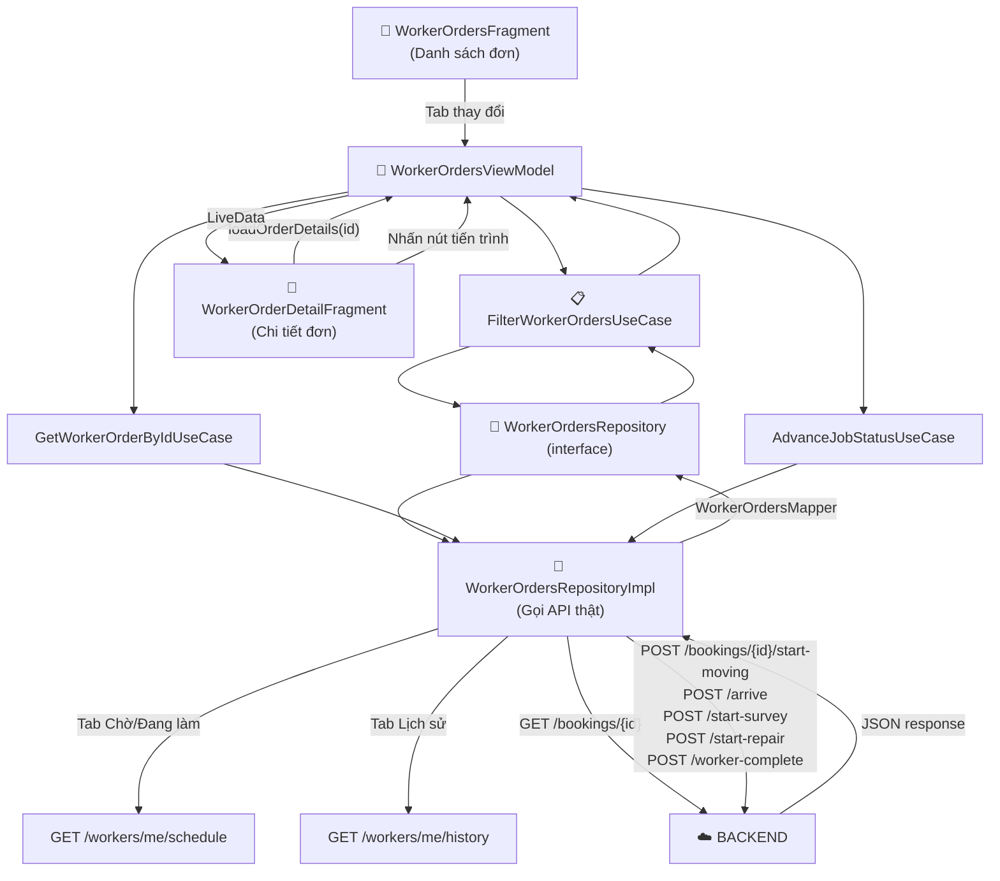

# Luồng tích hợp Booking — Worker Android ↔ Backend

> Tài liệu mô tả toàn bộ hành trình dữ liệu từ khi Thợ nhấn nút trên app cho đến khi trạng thái đơn hàng được cập nhật trong database, và ngược lại từ API phản hồi về UI.

---

## Tổng quan luồng dữ liệu



---

## Luồng tiến trình đơn hàng (State Machine)

```
[DB: Accepted]
      │
      ▼ Nút: "Bắt đầu di chuyển"
      POST /start-moving  →  Ghi BookingHistory(action="Moving")
      │
      ▼  [UI: ARRIVING - Step 2]
      │
      ▼ Nút: "Đã đến nơi"
      POST /arrive        →  Ghi BookingHistory(action="Arrived")
      POST /start-survey  →  DB status = Surveying
      │
      ▼  [UI: SURVEYING - Step 3]
      │
      ▼ Nút: "Bắt đầu sửa chữa" (Bắt buộc có ảnh minh chứng BEFORE_REPAIR)
      POST /start-repair  →  DB status = In_Progress
      │
      ▼  [UI: REPAIRING - Step 4] → Hiện nút thanh toán
      │
      ▼ Nút: "Thu tiền mặt" HOẶC Khách quét QR (Bắt buộc có ảnh minh chứng AFTER_REPAIR)
      POST /worker-complete → DB status = Waiting_Approval
      │
      ▼  [UI: COMPLETED - Step 5]
```

> 📌 **Lưu ý quan trọng về Bằng chứng Công việc (Proof-of-Work)**:
> Quy trình chuyển đổi trạng thái trên yêu cầu thợ tải lên ảnh minh chứng trước và sau khi sửa chữa. Chi tiết xem tại: [Tài liệu Tích hợp Bằng chứng Công việc (Proof-of-Work)](file:///f:/Project_personal/FixItVN/docs/proof_of_work_integration.md)

---


## PHẦN 1: BACKEND (Spring Boot)

### Cấu trúc folder liên quan

```
backend/src/main/java/com/fixit/domain/booking/
├── controller/
│   └── WorkerBookingActionController.java   ← Nhận request HTTP từ app Worker
├── service/
│   ├── WorkerBookingActionService.java       (interface)
│   └── WorkerBookingActionServiceImpl.java   (implementation — xử lý logic)
├── dto/response/
│   ├── WorkerBookingDetailResponse.java      ← DTO chi tiết đơn hàng
│   └── BookingActionResponse.java            ← DTO phản hồi sau mỗi hành động
├── entity/
│   ├── Booking.java                          ← Bảng bookings
│   ├── BookingHistory.java                   ← Bảng booking_history (log hành động)
│   └── BookingStatus.java                    (enum: Accepted, Surveying, In_Progress...)
└── repository/
    ├── BookingRepository.java
    └── BookingHistoryRepository.java
```

---

### Bước 1: Nhận Request — `controller/`

**File:** [WorkerBookingActionController.java](file:///f:/Project_personal/FixItVN/backend/src/main/java/com/fixit/domain/booking/controller/WorkerBookingActionController.java)

Controller **chỉ là cổng vào**, không chứa logic. Nó ánh xạ từng URL tới hàm service tương ứng:

| Endpoint | Method | Hành động |
|----------|--------|-----------|
| `/api/v1/bookings/{id}` | GET | Lấy chi tiết đơn hàng |
| `/api/v1/bookings/{id}/start-moving` | POST | Thợ bắt đầu di chuyển |
| `/api/v1/bookings/{id}/arrive` | POST | Thợ đã đến nơi |
| `/api/v1/bookings/{id}/start-survey` | POST | Bắt đầu khảo sát |
| `/api/v1/bookings/{id}/start-repair` | POST | Bắt đầu sửa chữa |
| `/api/v1/bookings/{id}/worker-complete` | POST | Thợ hoàn thành, chờ khách thanh toán |

---

### Bước 2: Xử lý Logic — `service/`

**File:** [WorkerBookingActionServiceImpl.java](file:///f:/Project_personal/FixItVN/backend/src/main/java/com/fixit/domain/booking/service/WorkerBookingActionServiceImpl.java)

#### `getBookingDetails(bookingId)` — Lấy chi tiết đơn

Logic quan trọng:
1. Lấy `workerId` từ JWT token (qua `CurrentWorkerResolver`)
2. Tìm Booking theo `bookingId`
3. **Kiểm tra quyền:** Nếu Booking không thuộc về Thợ này → throw `BOOKING_NOT_FOUND`
4. Gọi `getDoneActions(bookingId)` → query `booking_history` lấy danh sách hành động đã thực hiện
5. Tính `nextAction` dựa vào status DB + doneActions (thợ đã moving chưa, đã arrive chưa...)
6. Trả về `WorkerBookingDetailResponse`

#### `startMoving(bookingId)` — Bắt đầu di chuyển

```
1. Xác minh Booking thuộc Thợ này
2. Kiểm tra status hiện tại phải là "Accepted"
3. Ghi record vào booking_history: action="Moving", changedAt=now
4. Gửi thông báo FCM cho Khách: "Thợ đang trên đường đến"
5. Trả BookingActionResponse(success=true, nextAction="arrive")
```

#### `arrive(bookingId)` — Xác nhận đến nơi

```
1. Kiểm tra lịch sử: phải có action="Moving" trước đó
2. Ghi booking_history: action="Arrived"
3. Gửi FCM cho Khách: "Thợ đã đến nơi"
4. Trả nextAction="start-survey"
```

#### `startSurvey(bookingId)` — Bắt đầu khảo sát

```
1. Kiểm tra có action="Arrived"
2. Đổi booking.status = "Surveying"
3. Ghi booking_history: action="Surveying"
4. Trả nextAction="start-repair"
```

#### `startRepair(bookingId)` — Bắt đầu sửa chữa

```
1. Kiểm tra status = "Surveying"
2. Đổi booking.status = "In_Progress"
3. Ghi booking_history: action="In_Progress"
4. Gửi FCM cho Khách: "Thợ đang sửa chữa"
5. Trả nextAction="worker-complete"
```

#### `workerComplete(bookingId)` — Thợ hoàn thành

```
1. Kiểm tra status = "In_Progress"
2. Đổi booking.status = "Waiting_Approval"  ← Chờ khách xác nhận thanh toán
3. Ghi booking_history: action="Worker_Completed"
4. Gửi FCM cho Khách: "Thợ đã hoàn thành, vui lòng thanh toán"
5. Trả nextAction="waiting_payment"
```

---

### Bước 3: DTO Response — `dto/response/`

#### `WorkerBookingDetailResponse` — Chi tiết đơn hàng

```java
{
  "bookingId": "uuid",
  "serviceName": "Sửa điện",
  "customerName": "Nguyễn Văn A",
  "customerPhone": "0901234567",
  "customerAvatar": "https://...",
  "address": "123 Lê Lợi, Q.1",
  "issueDescription": "Cầu dao bị hỏng",
  "scheduledTime": "2026-06-08T14:30:00",
  "paymentMethod": "CASH",
  "finalPrice": 350000,
  "status": "Accepted",
  "statusText": "Đã nhận đơn",
  "nextAction": "start-moving",
  "doneActions": []               // Danh sách hành động đã thực hiện
}
```

#### Mapping `nextAction` theo trạng thái

| `status` DB | `doneActions` chứa | `nextAction` trả về |
|-------------|-------------------|---------------------|
| `Accepted` | (trống) | `start-moving` |
| `Accepted` | `Moving` | `arrive` |
| `Accepted` | `Arrived` | `start-survey` |
| `Surveying` | – | `start-repair` |
| `In_Progress` | – | `worker-complete` |
| `Waiting_Approval` | – | `waiting_payment` |
| `Completed` | – | `done` |

---

## PHẦN 2: ANDROID CLIENT (Clean Architecture)

### Cấu trúc folder

```
android/.../feature/worker/orders/
├── di/
│   └── WorkerOrdersModule.java          ← Hilt DI: cung cấp API + Repository
├── data/
│   ├── remote/
│   │   ├── api/
│   │   │   └── WorkerOrdersApi.java     ← Interface Retrofit (8 endpoints)
│   │   ├── dto/
│   │   │   ├── WorkerBookingDetailResponseDto.java
│   │   │   ├── BookingActionResponseDto.java
│   │   │   ├── WorkerScheduleResponseDto.java
│   │   │   └── WorkerHistoryResponseDto.java
│   │   └── mapper/
│   │       └── WorkerOrdersMapper.java  ← Chuyển DTO → Domain Model
│   └── repository/
│       └── WorkerOrdersRepositoryImpl.java  ← Gọi API Retrofit thực tế
├── domain/
│   ├── model/
│   │   ├── WorkerOrder.java             ← Model sạch cho UI
│   │   ├── JobStatus.java               (enum: ACCEPTED, ARRIVING, SURVEYING...)
│   │   └── ExtraCostItem.java
│   ├── repository/
│   │   └── WorkerOrdersRepository.java  ← Interface (hợp đồng)
│   └── usecase/
│       ├── GetWorkerOrdersUseCase.java
│       ├── FilterWorkerOrdersUseCase.java
│       ├── GetWorkerOrderByIdUseCase.java
│       ├── AdvanceJobStatusUseCase.java
│       ├── GetInitialJobStatusUseCase.java
│       ├── SaveExtraCostsUseCase.java
│       ├── GetExtraCostsUseCase.java
│       ├── CalculateTotalExtraUseCase.java
│       └── GenerateWorkerPaymentQrUseCase.java
└── presentation/
    ├── WorkerOrdersViewModel.java        ← Trung tâm điều phối LiveData
    ├── list/
    │   ├── WorkerOrdersFragment.java     ← Màn hình danh sách
    │   └── WorkerOrderAdapter.java
    ├── detail/
    │   └── WorkerOrderDetailFragment.java ← Màn hình chi tiết + tiến trình
    ├── invoice/
    │   └── WorkerInvoiceFragment.java
    └── complaint/
        └── WorkerComplaintFragment.java
```

---

### Tầng 1: `di/` — Dependency Injection

**File:** [WorkerOrdersModule.java](file:///f:/Project_personal/FixItVN/android/app/src/main/java/com/fixit/feature/worker/orders/di/WorkerOrdersModule.java)

Module này nối dây toàn bộ hệ thống Orders cho Hilt. Nó khai báo:
- `WorkerOrdersApi` được tạo từ `Retrofit` singleton (đã có sẵn JWT interceptor)
- `WorkerOrdersRepository` được bind với `WorkerOrdersRepositoryImpl`

---

### Tầng 2: `data/` — Tầng dữ liệu

#### `WorkerOrdersApi.java` — Định nghĩa endpoint

**File:** [WorkerOrdersApi.java](file:///f:/Project_personal/FixItVN/android/app/src/main/java/com/fixit/feature/worker/orders/data/remote/api/WorkerOrdersApi.java)

```java
@GET("api/v1/workers/me/schedule")
Call<ApiResponse<WorkerScheduleResponseDto>> getSchedule();

@GET("api/v1/workers/me/history")
Call<ApiResponse<WorkerHistoryResponseDto>> getHistory(@Query("status") String status);

@GET("api/v1/bookings/{bookingId}")
Call<ApiResponse<WorkerBookingDetailResponseDto>> getBookingDetails(@Path("bookingId") String id);

@POST("api/v1/bookings/{bookingId}/start-moving")
Call<ApiResponse<BookingActionResponseDto>> startMoving(@Path("bookingId") String id);
// ... arrive, startSurvey, startRepair, workerComplete
```

#### `WorkerOrdersMapper.java` — Chuyển đổi dữ liệu

**File:** [WorkerOrdersMapper.java](file:///f:/Project_personal/FixItVN/android/app/src/main/java/com/fixit/feature/worker/orders/data/remote/mapper/WorkerOrdersMapper.java)

Mapper thực hiện 3 việc:

| Xử lý | Logic |
|--------|-------|
| `mapStatus()` | Chuyển `status` DB + `doneActions` → chuỗi UI ("pending", "ongoing", "completed", "cancelled") |
| `formatPrice()` | `Double 350000.0` → `"350.000 đ"` (nếu null → `"Chưa báo giá"`) |
| `formatTime()` | `"2026-06-08T14:30:00"` → `"Ngày 08/06 14:30"` |

#### `WorkerOrdersRepositoryImpl.java` — Gọi API thực tế

**File:** [WorkerOrdersRepositoryImpl.java](file:///f:/Project_personal/FixItVN/android/app/src/main/java/com/fixit/feature/worker/orders/data/repository/WorkerOrdersRepositoryImpl.java)

Đây là nơi gọi API Retrofit thực tế. Mỗi hàm sử dụng pattern `enqueue()` bất đồng bộ:

```java
// Lấy danh sách theo lịch
api.getSchedule().enqueue(callback → {
    // Xử lý response, map DTO → WorkerOrder[]
    // Trả ResultCallback.onResult(Result.success(orders))
});

// Tiến trình: Arriving = arrive() rồi tự động gọi startSurvey()
api.arrive(orderId).enqueue(callback → {
    if (success) {
        api.startSurvey(orderId).enqueue(callback2 → {
            if (success) → Result.success(JobStatus.SURVEYING)
        });
    }
});
```

> **Lưu ý:** Bước `ARRIVING → SURVEYING` gọi 2 API liên tiếp (arrive rồi startSurvey) vì backend thiết kế tách biệt 2 hành động. Client tự động gọi chuỗi này để đơn giản hóa UX.

---

### Tầng 3: `domain/` — Tầng nghiệp vụ

#### `JobStatus.java` — Enum trạng thái UI

```java
public enum JobStatus {
    ACCEPTED(1, "Bắt đầu di chuyển"),
    ARRIVING(2, "Đã đến nơi"),
    SURVEYING(3, "Bắt đầu sửa chữa"),
    REPAIRING(4, "Hoàn thành công việc"),
    COMPLETED(5, "Đã hoàn thành");
}
```

Mỗi bước có `step` (số thứ tự timeline) và `nextActionText` (text hiển thị trên nút).

#### Mapping DB → UI

| DB `status` | `doneActions` | `JobStatus` UI | Timeline step |
|-------------|---------------|----------------|---------------|
| `Accepted` | (trống) | `ACCEPTED` | 1 |
| `Accepted` | Moving | `ARRIVING` | 2 |
| `Surveying` | – | `SURVEYING` | 3 |
| `In_Progress` | – | `REPAIRING` | 4 |
| `Waiting_Approval` | – | `REPAIRING` | 4 (hiện thanh toán) |
| `Completed` | – | `COMPLETED` | 5 |

#### UseCases — Hành động nghiệp vụ

| UseCase | Mô tả |
|---------|-------|
| `GetWorkerOrdersUseCase` | Lấy danh sách đơn theo lịch hôm nay |
| `FilterWorkerOrdersUseCase` | Lọc theo tab (pending/ongoing/history) |
| `GetWorkerOrderByIdUseCase` | Lấy chi tiết 1 đơn hàng |
| `AdvanceJobStatusUseCase` | Tiến hành bước tiếp theo (gọi API) |
| `GetInitialJobStatusUseCase` | Tính `JobStatus` ban đầu từ chuỗi status DB |
| `GenerateWorkerPaymentQrUseCase` | Tạo URL QR VietQR để thanh toán |
| `SaveExtraCostsUseCase` | Lưu danh sách chi phí phát sinh |
| `CalculateTotalExtraUseCase` | Tính tổng phí phát sinh |

---

### Tầng 4: `presentation/` — Tầng giao diện

#### `WorkerOrdersViewModel.java`

**File:** [WorkerOrdersViewModel.java](file:///f:/Project_personal/FixItVN/android/app/src/main/java/com/fixit/feature/worker/orders/presentation/WorkerOrdersViewModel.java)

ViewModel quản lý 4 LiveData chính:

| LiveData | Kiểu | Mô tả |
|----------|------|-------|
| `filteredOrders` | `List<WorkerOrder>` | Danh sách đơn theo tab đang chọn |
| `orderDetails` | `WorkerOrder` | Chi tiết 1 đơn hàng đang xem |
| `currentStatus` | `JobStatus` | Bước tiến trình hiện tại |
| `extraItems` | `List<ExtraCostItem>` | Danh sách phí phát sinh |

Hàm quan trọng:

```java
// Gọi khi vào màn hình chi tiết
viewModel.loadOrderDetails(orderId)
    → getWorkerOrderByIdUseCase.execute(orderId, callback)
    → _orderDetails.postValue(order)
    → initializeStatus(order.getStatus())  // set bước timeline

// Gọi khi nhấn nút tiến trình
viewModel.advanceStatus(orderId)
    → advanceJobStatusUseCase.execute(orderId, currentStatus, callback)
    → _currentStatus.postValue(nextStatus)
```

#### `WorkerOrderDetailFragment.java`

**File:** [WorkerOrderDetailFragment.java](file:///f:/Project_personal/FixItVN/android/app/src/main/java/com/fixit/feature/worker/orders/presentation/detail/WorkerOrderDetailFragment.java)

Fragment quan sát 2 LiveData:

```java
// Quan sát chi tiết đơn → bind dữ liệu lên UI
viewModel.orderDetails.observe(owner, order -> {
    currentOrder = order;
    bindOrderData(order);  // tên dịch vụ, khách hàng, địa chỉ, giá
});

// Quan sát trạng thái tiến trình → cập nhật timeline
viewModel.currentStatus.observe(owner, status -> {
    updateTimelineUI(status);  // tô màu các bước, hiện/ẩn nút
});
```

`updateTimelineUI(status)` xử lý:
- `REPAIRING` → Ẩn nút "Tiếp theo", hiện 2 nút thanh toán (QR + Tiền mặt), hiện card thanh toán
- `COMPLETED` → Nút xám, text "Đã hoàn thành", card thanh toán = "Đã thanh toán"
- Các bước còn lại → Nút xanh, text theo `status.getNextActionText()`

---

## PHẦN 3: Thanh toán — VietQR

### Luồng thanh toán QR

```
Thợ nhấn "Hiển thị QR"
    → viewModel.generateVietQrUrl(orderId, totalAmount)
    → "https://img.vietqr.io/image/MB-0859226688-qr_only.png
       ?amount=350000&addInfo=FIXIT+ORD+{id}&accountName=CONG+TY+FIXIT+VN"
    → Glide load ảnh QR từ URL
    → Giả lập: sau 4s nếu chưa COMPLETED → tự động gọi advanceStatus()
               (trong production sẽ có webhook backend thay thế)
```

### Luồng thanh toán tiền mặt

```
Thợ nhấn "Xác nhận thu tiền mặt"
    → confirmCashPayment()
    → viewModel.advanceStatus(orderId)
    → POST /worker-complete
    → DB: status = Waiting_Approval
    → UI: chuyển sang COMPLETED
```

### Tính tổng tiền

```
Tổng = basePrice (từ WorkerOrder.getPrice()) + extraCosts
extraCosts = danh sách phí phát sinh thợ thêm vào màn ExtraCost
```

---

## Ghi chú triển khai

### JWT Authentication

Mọi request đến backend đều tự động kèm header `Authorization: Bearer {token}` nhờ `AuthInterceptor` trong `NetworkModule`. Thợ không cần làm gì thêm sau khi đăng nhập.

### Xử lý lỗi

Mọi lỗi API đều được bọc trong `Result.error(AppError)` → ViewModel nhận → `setError(message)` → Fragment lắng nghe `viewModel.errorMessage.observe()` → hiển thị Toast.

### Pattern bất đồng bộ

Toàn bộ tầng Data dùng pattern `ResultCallback<T>`:
```java
public interface ResultCallback<T> {
    void onResult(Result<T> result);  // Luôn gọi trên main thread không?
                                      // Cần đảm bảo postValue() thay vì setValue()
}
```

> ⚠️ **Lưu ý:** Retrofit callback chạy trên background thread. Khi cập nhật LiveData từ callback, phải dùng `postValue()` (không dùng `setValue()` sẽ crash). `WorkerOrdersRepositoryImpl` đã tuân thủ điều này.

---

## Danh sách file thay đổi trong lần tích hợp này

### Backend
| File | Loại | Mô tả |
|------|------|-------|
| `WorkerBookingDetailResponse.java` | MỚI | DTO chi tiết đơn hàng cho Thợ |
| `WorkerBookingActionService.java` | SỬA | Thêm method `getBookingDetails` |
| `WorkerBookingActionServiceImpl.java` | SỬA | Implement logic + tính nextAction |
| `WorkerBookingActionController.java` | SỬA | Thêm endpoint GET /bookings/{id} |

### Android
| File | Loại | Mô tả |
|------|------|-------|
| `WorkerOrdersApi.java` | MỚI | Retrofit interface 8 endpoints |
| `WorkerBookingDetailResponseDto.java` | MỚI | DTO chi tiết đơn |
| `BookingActionResponseDto.java` | MỚI | DTO phản hồi action |
| `WorkerScheduleResponseDto.java` | MỚI | DTO danh sách lịch |
| `WorkerHistoryResponseDto.java` | MỚI | DTO lịch sử |
| `WorkerOrdersMapper.java` | MỚI | Mapper DTO → Domain |
| `WorkerOrdersModule.java` | SỬA | Thêm provide WorkerOrdersApi |
| `WorkerOrdersRepository.java` | SỬA | Chuyển sang ResultCallback |
| `WorkerOrdersRepositoryImpl.java` | VIẾT LẠI | Gọi API thực tế |
| `GetWorkerOrdersUseCase.java` | SỬA | Bất đồng bộ |
| `FilterWorkerOrdersUseCase.java` | SỬA | Bất đồng bộ |
| `GetWorkerOrderByIdUseCase.java` | SỬA | Bất đồng bộ |
| `AdvanceJobStatusUseCase.java` | SỬA | Thêm orderId param |
| `WorkerOrdersViewModel.java` | VIẾT LẠI | LiveData orderDetails, loading, async |
| `WorkerOrderDetailFragment.java` | VIẾT LẠI | Observe LiveData, async load |
| `WorkerComplaintFragment.java` | SỬA | Observe orderDetails LiveData |
| `WorkerInvoiceFragment.java` | SỬA | Observe orderDetails LiveData |
