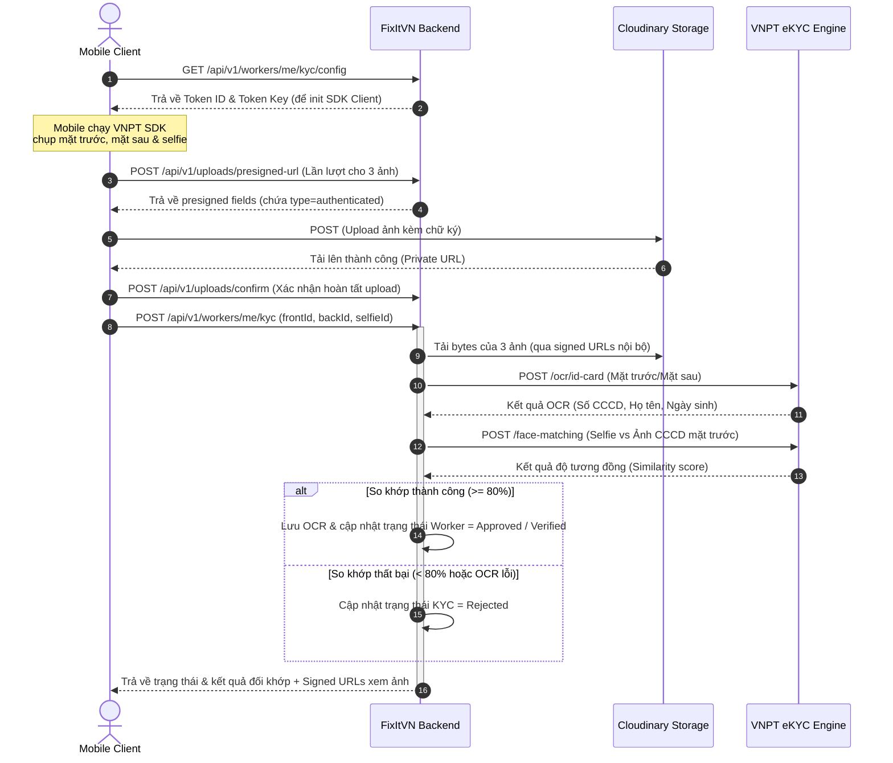

# Tài liệu tích hợp VNPT eKYC & Lưu trữ bảo mật Cloudinary (Backend)

Hệ thống FixItVN đã hỗ trợ cơ chế xác thực tự động KYC của thợ (Worker) qua dịch vụ **VNPT eKYC** và áp dụng chính sách bảo mật cho ảnh CCCD/Selfie trên **Cloudinary** (ngăn chặn truy cập công khai).

---

## 1. Kiến trúc hệ thống & Luồng xử lý (Data Flow)

Luồng hoạt động từ lúc Mobile lấy cấu hình đến khi xác thực tự động:



---

## 2. API Endpoints

### 2.1 Lấy cấu hình SDK
* **Endpoint**: `GET /api/v1/workers/me/kyc/config`
* **Mô tả**: Trả về các Token bảo mật để Mobile cấu hình và khởi chạy SDK VNPT.
* **Response (JSON)**:
  ```json
  {
      "status": "success",
      "message": "Thành công",
      "data": {
          "tokenId": "YOUR_VNPT_TOKEN_ID",
          "tokenKey": "YOUR_VNPT_TOKEN_KEY",
          "apiUrl": "https://api-ekyc.vnpt.vn/api/v1"
      }
  }
  ```

### 2.2 Nộp Hồ sơ KYC
* **Endpoint**: `POST /api/v1/workers/me/kyc`
* **Request Body (JSON)**:
  ```json
  {
      "frontImageUploadId": "a90f1110-3351-4e08-9df8-2b814a0653d9",
      "backImageUploadId": "a90f1110-3351-4e08-9df8-2b814a0653da",
      "selfieImageUploadId": "a90f1110-3351-4e08-9df8-2b814a0653db",
      "certificateUploadIds": []
  }
  ```
* **Response (JSON)**:
  ```json
  {
      "status": "success",
      "message": "Nộp hồ sơ KYC thành công",
      "data": {
          "kycId": "73c683b5-31a8-48b0-8c29-3738cfcb08e3",
          "workerId": "65b9e078-43d9-4d6d-8b01-fbbe6ab8ea54",
          "frontImageUrl": "https://res.cloudinary.com/.../authenticated/...?...signature...",
          "backImageUrl": "https://res.cloudinary.com/.../authenticated/...?...signature...",
          "selfieImageUrl": "https://res.cloudinary.com/.../authenticated/...?...signature...",
          "ocrFullName": "NGUYEN VAN THO",
          "ocrIdentityCard": "123456789012",
          "similarityScore": 92.5,
          "certificateUrls": [],
          "status": "APPROVED" // APPROVED | REJECTED | PENDING
      }
  }
  ```

### 2.3 Xem trạng thái KYC hiện tại
* **Endpoint**: `GET /api/v1/workers/me/kyc/status`
* **Mô tả**: Trả về thông tin trạng thái KYC và sinh Signed URLs mới có hạn dùng trong 1 giờ.
* **Response**: Tương tự như data của API Nộp Hồ sơ KYC.

---

## 3. Cơ chế Bảo mật ảnh (Cloudinary Authenticated)

1. **Upload**: Trong `CloudinaryUploadSigner.java`, khi client yêu cầu chữ ký upload với purpose là `WORKER_KYC_FRONT`, `WORKER_KYC_BACK` hoặc `WORKER_KYC_SELFIE`, backend sẽ tự động thêm `"type": "authenticated"` vào tham số ký số gửi cho Cloudinary. Việc này chặn quyền đọc công khai (public) qua link thông thường.
2. **Download / View**: Khi backend trả về thông tin ảnh cho Mobile hoặc Admin, backend không trả về link ảnh lưu trực tiếp trong cơ sở dữ liệu. Thay vào đó, backend sử dụng thư viện SDK Cloudinary để sinh **Signed URL có chứa chữ ký xác thực lâm thời** (`expires_in = 3600` giây). Sau khi hết hạn 1 giờ, link này sẽ tự động mất hiệu lực nhằm bảo mật dữ liệu nhạy cảm của thợ.

---

## 4. Chế độ Kiểm thử tự động (Mock/Simulation)
Do VNPT eKYC yêu cầu tài khoản doanh nghiệp thực tế để sử dụng, hệ thống được cấu hình chế độ **Auto-Mock**:
- Nếu `client-id` trong `application-dev.yml` được cấu hình bắt đầu bằng tiền tố `YOUR_` hoặc để trống, hệ thống sẽ tự động chuyển sang chế độ Mock: giả lập kết quả OCR thành công (Họ tên: `NGUYEN VAN THO`, Số CCCD: `123456789012`) và điểm tương đồng khuôn mặt `92.5%` (vượt ngưỡng kiểm thử 80%).
- Khi đưa vào vận hành thực tế, bạn chỉ cần thay thế các biến cấu hình `vnpt.ekyc.client-id` và `client-secret` bằng tài khoản VNPT thật mà không cần sửa đổi bất kỳ dòng mã nguồn Java nào.
