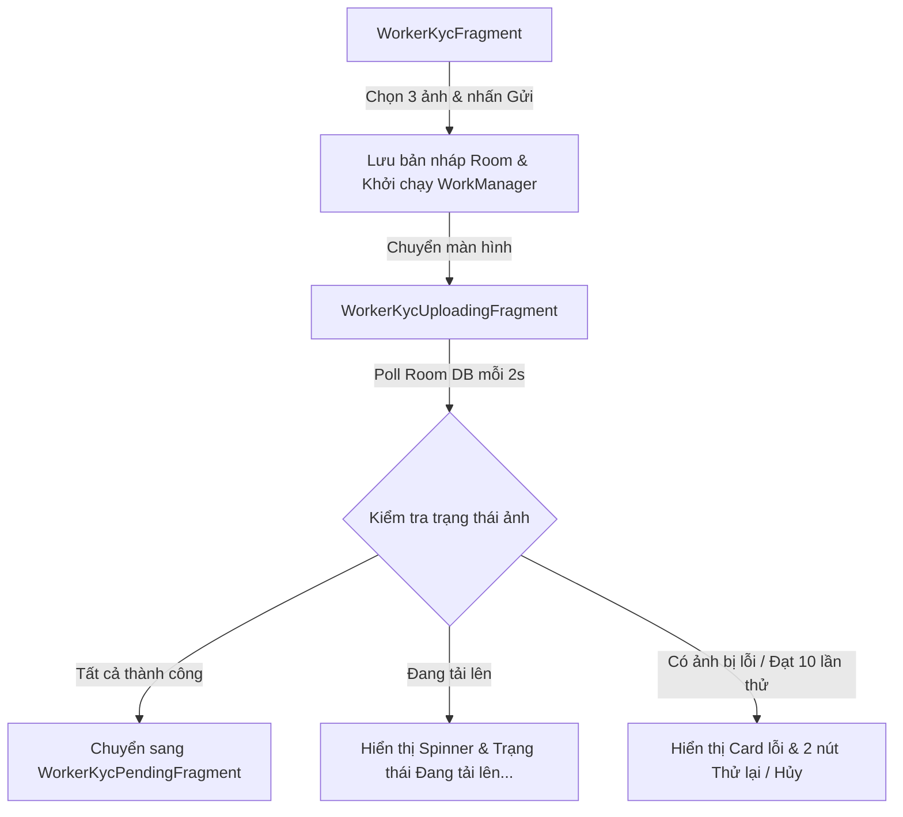

# Tài liệu Hướng dẫn Kiểm thử luồng đăng ảnh KYC chạy ngầm (Android)

Tài liệu này hướng dẫn chi tiết cách hoạt động và cách thiết lập kiểm thử (manual test) cho cơ chế tải lên KYC chạy ngầm có khả năng tự động khôi phục, retry khi lỗi mạng và cho phép hủy bỏ phiên làm việc.

---

## 1. Tổng quan Luồng KYC Tải lên Chạy ngầm

Luồng đăng ảnh KYC gồm 3 ảnh chính: **Mặt trước CCCD** (`front`), **Mặt sau CCCD** (`back`), và **Ảnh chân dung** (`certificate`).

### Các trạng thái và cơ chế phục hồi chính:
1.  **Lưu trữ bản nháp (Local Persistence)**: Ngay khi chọn ảnh, thông tin file tạm được lưu vào bảng `pending_uploads` của Room DB dưới dạng bản nháp (`LOCAL_SELECTED`). Do đó, nếu thoát app trước khi nhấn gửi, ảnh vẫn được giữ nguyên.
2.  **Khôi phục màn hình khi thoát app**: Trong `WorkerKycFragment.onResume()`, hệ thống sẽ truy vấn Room. Nếu phát hiện có KYC đang trong tiến trình tải lên chạy ngầm, app sẽ tự động điều hướng thẳng đến `WorkerKycUploadingFragment` để hiển thị tiến trình.
3.  **Không bị mất dữ liệu lỗi**: Thay vì xóa bản ghi ngay khi gặp lỗi mạng/lỗi API (quá 10 lần thử), ảnh bị lỗi vẫn được lưu trong Room với trạng thái `_FAILED` để giao diện người dùng biết chính xác ảnh nào lỗi và thông báo chi tiết lỗi (`lastError`).

---

## 2. Hướng dẫn các kịch bản kiểm thử (Manual Test Cases)

### Kịch bản 1: Đăng tải thành công trong điều kiện bình thường
*   **Các bước thực hiện**:
    1.  Mở màn hình Xác minh danh tính (`WorkerKycFragment`).
    2.  Chọn đủ 3 ảnh (Mặt trước, mặt sau, chân dung).
    3.  Nhấn nút **Gửi xét duyệt**.
*   **Kết quả mong đợi**:
    *   Ứng dụng chuyển sang màn hình **Đang gửi hồ sơ** (`WorkerKycUploadingFragment`).
    *   Trạng thái 3 ảnh hiển thị "Đang tải lên..." cùng biểu tượng đồng hồ xoay màu xanh dương.
    *   Sau khi tải xong cả 3 ảnh lên Cloudinary và xác nhận với Backend thành công, ứng dụng tự động điều hướng sang màn hình **Chờ duyệt** (`WorkerKycPendingFragment`).

---

### Kịch bản 2: Tự động tiếp tục tiến trình khi tắt và mở lại App
*   **Các bước thực hiện**:
    1.  Chọn đủ 3 ảnh và nhấn **Gửi xét duyệt**.
    2.  Khi màn hình đang hiện "Đang tải lên...", vuốt tắt ứng dụng hoàn toàn (Kill App) từ danh sách ứng dụng gần đây.
    3.  Mở lại ứng dụng.
    4.  Nhấp vào mục **Xác minh danh tính** hoặc **Hồ sơ KYC**.
*   **Kết quả mong đợi**:
    *   Ứng dụng phát hiện có tiến trình KYC đang chạy ngầm và tự động chuyển hướng người dùng thẳng vào màn hình **Đang gửi hồ sơ**.
    *   Tiến trình tải lên vẫn tiếp tục chạy ngầm thông qua WorkManager mà không bị mất dữ liệu hay phải chọn lại ảnh từ đầu.

---

### Kịch bản 3: Giả lập lỗi mạng / Lỗi tải lên
*   **Các bước thực hiện**:
    1.  Nhấn **Gửi xét duyệt** để bắt đầu tải lên.
    2.  Tắt kết nối Wi-Fi/Mobile Data trên điện thoại ngay lập tức (hoặc bật Chế độ máy bay).
    3.  Chờ đợi hệ thống tự động thử lại ngầm (WorkManager chạy ngầm với cơ chế tăng dần thời gian giãn cách).
    4.  *Mẹo đẩy nhanh tiến trình*: Để mô phỏng đạt giới hạn thử lại nhanh hơn, bạn có thể chỉnh sửa giá trị `retryCount` của bản ghi trong file database Room thành `10` hoặc sửa trực tiếp mã nguồn để giảm `MAX_RETRY_COUNT` xuống `2`.
*   **Kết quả mong đợi**:
    *   Biểu tượng trạng thái của ảnh bị lỗi đổi sang màu đỏ kèm dấu chấm than cảnh báo ("Lỗi tải lên").
    *   Thanh tiến trình loading trung tâm biến mất.
    *   Xuất hiện **Card lỗi** màu đỏ hiển thị thông điệp lỗi chi tiết (ví dụ: `Tải lên thất bại: Network unreachable` hoặc lỗi API tương ứng).
    *   Hai nút **Thử lại** và **Hủy & Làm lại** xuất hiện ở dưới cùng.

---

### Kịch bản 4: Sử dụng tính năng "Hủy & Làm lại" khi lỗi
*   **Các bước thực hiện**:
    1.  Sau khi giao diện báo lỗi tải lên (như ở Kịch bản 3).
    2.  Nhấn vào nút **Hủy & Làm lại**.
*   **Kết quả mong đợi**:
    *   Ứng dụng thực hiện xóa sạch toàn bộ các bản ghi thuộc nhóm KYC này trong cơ sở dữ liệu Room.
    *   Các file ảnh tạm đã lưu trong bộ nhớ máy của app được dọn dẹp để giải phóng dung lượng.
    *   Ứng dụng quay trở lại màn hình chọn ảnh ban đầu (`WorkerKycFragment`) ở trạng thái trống, cho phép người dùng chọn các file ảnh mới và thử lại từ đầu.

---

### Kịch bản 5: Sử dụng tính năng "Thử lại" thủ công
*   **Các bước thực hiện**:
    1.  Sau khi giao diện báo lỗi tải lên (như ở Kịch bản 3).
    2.  Bật lại kết nối mạng Wi-Fi/Data trên điện thoại.
    3.  Nhấn vào nút **Thử lại**.
*   **Kết quả mong đợi**:
    *   Số lần thử lại (`retryCount`) của các ảnh lỗi trong database được reset về `0`.
    *   WorkManager được lên lịch lại ngay lập tức với cơ chế thay thế (`REPLACE`) giúp tiến trình tải lên được kích hoạt lại ngay mà không phải chờ đợi.
    *   Thẻ báo lỗi ẩn đi, biểu tượng tải lên quay trở lại trạng thái "Đang tải lên..." màu xanh dương và tiếp tục hoàn tất đăng tải.

---

## 3. Các lưu ý kỹ thuật khi kiểm thử nâng cao
*   **Đường dẫn thư mục ảnh tạm**: Toàn bộ ảnh được lưu tại thư mục bộ nhớ trong của ứng dụng: `Context.getFilesDir() + "/pending_uploads/"`.
*   **Xem Database Room**: Sử dụng tính năng **Database Inspector** của Android Studio để xem trực quan bảng `pending_uploads`. Bạn có thể thay đổi thủ công cột `status` hoặc `retryCount` trực tiếp trong Database Inspector để kiểm tra các trạng thái giao diện UI của Fragment ngay lập tức.
