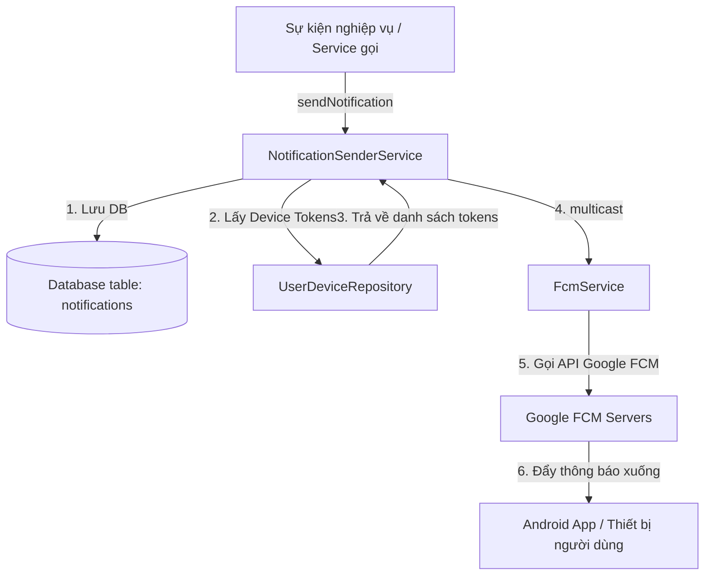

# Tài liệu Thiết kế & Tích hợp Hệ thống Thông báo (Notification System)

Tài liệu này mô tả chi tiết hạ tầng Firebase Cloud Messaging (FCM) và các trigger thông báo được tích hợp trên Spring Boot Backend của dự án FixIt VN.

---

## 1. Kiến trúc & Luồng hoạt động

Kiến trúc hệ thống thông báo được phân tách thành 3 tầng:
* **Tầng nghiệp vụ (Business Triggers):** Các Service (Booking, Assignment,...) bắt sự kiện trạng thái thay đổi và gọi Service thông báo.
* **Tầng quản trị thông báo (Notification Manager):** Lưu vết thông báo vào database (`notifications`), tra cứu token thiết bị (`user_devices`).
* **Tầng vận chuyển (FCM Push Service):** Đóng gói payload và gọi Google FCM API thông qua Firebase Admin SDK.



---

## 2. Cấu trúc Database liên quan

### Bảng `notifications` (Lịch sử thông báo của user)
Lưu trữ tất cả các thông báo đã gửi để hiển thị danh sách thông báo trên ứng dụng (In-app notification list).
* `id`: UUID (Khóa chính)
* `user_id`: UUID (FK liên kết với bảng `users`)
* `title`: VARCHAR (Tiêu đề)
* `content`: TEXT (Nội dung thông báo)
* `is_read`: BOOLEAN (Trạng thái đã đọc hay chưa)
* `created_at`: TIMESTAMP (Thời gian tạo)

### Bảng `user_devices` (Quản lý tokens thiết bị)
Lưu trữ các FCM Token đăng ký từ thiết bị Android của người dùng.
* `id`: UUID (Khóa chính)
* `user_id`: UUID (FK liên kết với bảng `users`)
* `device_token`: VARCHAR (FCM token đăng ký)
* `device_os`: VARCHAR/ENUM (`ANDROID`, `IOS`, v.v.)
* `updated_at`: TIMESTAMP (Thời gian cập nhật gần nhất)

---

## 3. Danh sách các Triggers thông báo trong Booking

Dưới đây là các sự kiện sẽ tự động kích hoạt thông báo gửi đến Khách hàng (Customer) khi Thợ (Worker) thao tác:

| Nghiệp vụ (API) | Tiêu đề thông báo | Nội dung thông báo | Loại (`type` trong payload data) |
| :--- | :--- | :--- | :--- |
| **Thợ nhận đơn** (`accept`) | Thợ đã nhận đơn đặt lịch | Thợ [Tên thợ] đã nhận đơn đặt lịch của bạn. | `BOOKING_ACCEPTED` |
| **Thợ di chuyển** (`startMoving`) | Thợ đang di chuyển | Thợ [Tên thợ] đang di chuyển đến địa chỉ của bạn. | `WORKER_MOVING` |
| **Thợ đến nơi** (`arrive`) | Thợ đã đến nơi | Thợ [Tên thợ] đã có mặt tại điểm hẹn. | `WORKER_ARRIVED` |
| **Bắt đầu khảo sát** (`startSurvey`) | Bắt đầu khảo sát | Thợ [Tên thợ] đang thực hiện khảo sát tình trạng hư hỏng. | `START_SURVEY` |
| **Bắt đầu sửa chữa** (`startRepair`) | Bắt đầu sửa chữa | Thợ [Tên thợ] đã bắt đầu sửa chữa thiết bị. | `START_REPAIR` |
| **Báo hoàn thành** (`workerComplete`) | Công việc đã hoàn thành | Thợ [Tên thợ] báo cáo đã hoàn thành công việc. Vui lòng kiểm tra và duyệt nghiệm thu. | `WORKER_COMPLETE` |

### Cấu trúc Data Payload gửi kèm FCM:
Mỗi thông báo đẩy đều chứa dữ liệu bổ sung để ứng dụng Android có thể điều hướng hoặc cập nhật giao diện (UI) mà không cần load lại:
```json
{
  "bookingId": "uuid-của-booking",
  "status": "Trạng thái Booking mới (e.g. Accepted, Surveying, In_Progress, Waiting_Approval)",
  "type": "Mã loại thông báo (e.g. BOOKING_ACCEPTED, WORKER_MOVING...)"
}
```

---

## 4. Chi tiết các Class triển khai

### Tầng cấu hình & Kết nối Firebase:
* **`FirebaseConfig`**: Tải file thông tin tài khoản dịch vụ (`firebase-service-account.json`) từ thư mục `resources` để khởi tạo `FirebaseApp`.
  * Có cơ chế **Fallback**: Nếu không tìm thấy file cấu hình, ứng dụng sẽ ghi nhận cảnh báo Log và tiếp tục chạy mà không gây crash hệ thống, giúp môi trường local dev không bị gián đoạn.

### Tầng dịch vụ FCM:
* **`FcmService` / `FcmServiceImpl`**:
  * Đóng gói và gửi thông báo đơn lẻ hoặc gửi multicast (đồng loạt nhiều thiết bị của 1 User).
  * Sử dụng SDK chính thức của Google Firebase Admin.

### Tầng gửi thông báo nghiệp vụ:
* **`NotificationSenderService` / `NotificationSenderServiceImpl`**:
  * Điểm chạm chính để các nghiệp vụ khác gọi gửi thông báo.
  * Tự động xử lý lưu Database lịch sử trước khi gửi push qua FCM.
  * Tự động lấy các Device Token hợp lệ từ `UserDeviceRepository`.

---

## 5. Hướng dẫn thiết lập & Chạy thử

### Cấu hình file Key Firebase:
1. Truy cập vào Firebase Console của dự án.
2. Vào **Project Settings** -> **Service Accounts**.
3. Chọn **Generate New Private Key** và tải file JSON về.
4. Đổi tên file thành `firebase-service-account.json`.
5. Đặt file này vào thư mục tài nguyên của backend:
   `backend/src/main/resources/firebase-service-account.json`

### Kiểm thử cục bộ:
1. Đăng nhập ứng dụng Android hoặc gọi API đăng ký Token thiết bị để lưu token vào bảng `user_devices`.
2. Thực hiện các thao tác đổi trạng thái Booking (ví dụ: Gọi API `accept` hoặc `start-moving` của Worker).
3. Quan sát log hệ thống để kiểm tra luồng gửi FCM.

---

## 6. Triển khai phía Android Client (Phase 3)

Phần này hướng dẫn chi tiết cách cấu hình và triển khai nhận thông báo FCM ở phía Android Client (Ứng dụng khách hàng và Thợ).

### 6.1. Cấu hình Gradle & Manifest
1. **Gradle (`app/build.gradle`)**:
   - Áp dụng Plugin: `id 'com.google.gms.google-services'`
   - Khai báo Dependency: `implementation 'com.google.firebase:firebase-messaging:24.1.0'`
2. **Manifest (`AndroidManifest.xml`)**:
   - Khai báo quyền hiển thị thông báo (Android 13+):
     ```xml
     <uses-permission android:name="android.permission.POST_NOTIFICATIONS"/>
     ```
   - Khai báo FCM Service để xử lý tin nhắn đẩy:
     ```xml
     <service
         android:name="com.fixit.core.fcm.MyFirebaseMessagingService"
         android:exported="false">
         <intent-filter>
             <action android:name="com.google.firebase.MESSAGING_EVENT"/>
         </intent-filter>
     </service>
     ```

### 6.2. Cấu trúc Source Code Client
Áp dụng mô hình **Clean Architecture & Domain-Driven Design (DDD)**:

* **Tầng Data (Data Layer)**:
  * [NotificationApi.java](file:///f:/Project_personal/FixItVN/android/app/src/main/java/com/fixit/feature/notification/data/remote/api/NotificationApi.java): Định nghĩa các Endpoint Retrofit để đăng ký/hủy Token thiết bị lên Backend (`POST api/v1/users/me/device-tokens`, `DELETE api/v1/users/me/device-tokens/{deviceToken}`).
  * [DeviceTokenRequest.java](file:///f:/Project_personal/FixItVN/android/app/src/main/java/com/fixit/feature/notification/data/remote/dto/DeviceTokenRequest.java): DTO đóng gói Payload gửi lên API.
  * [NotificationRepositoryImpl.java](file:///f:/Project_personal/FixItVN/android/app/src/main/java/com/fixit/feature/notification/data/repository/NotificationRepositoryImpl.java): Thực thi gọi Retrofit API và phản hồi qua `ResultCallback`.
* **Tầng Domain (Domain Layer)**:
  * [NotificationRepository.java](file:///f:/Project_personal/FixItVN/android/app/src/main/java/com/fixit/feature/notification/domain/repository/NotificationRepository.java): Khai báo Interface Repository.
  * [RegisterDeviceTokenUseCase.java](file:///f:/Project_personal/FixItVN/android/app/src/main/java/com/fixit/feature/notification/domain/usecase/RegisterDeviceTokenUseCase.java): UseCase xử lý đăng ký Token thiết bị.
  * [RemoveDeviceTokenUseCase.java](file:///f:/Project_personal/FixItVN/android/app/src/main/java/com/fixit/feature/notification/domain/usecase/RemoveDeviceTokenUseCase.java): UseCase xử lý hủy/gỡ bỏ Token thiết bị (khi đăng xuất).
* **Tầng DI (Dependency Injection)**:
  * [NotificationModule.java](file:///f:/Project_personal/FixItVN/android/app/src/main/java/com/fixit/feature/notification/di/NotificationModule.java): Hilt Module cung cấp API Instance và Repository Implementation.
* **Tầng Core FCM (Core Service)**:
  * [MyFirebaseMessagingService.java](file:///f:/Project_personal/FixItVN/android/app/src/main/java/com/fixit/core/fcm/MyFirebaseMessagingService.java):
    * `onNewToken`: Lấy token mới và tự động gửi đồng bộ lên Backend nếu User đã đăng nhập.
    * `onMessageReceived`: Nhận Push Message, xây dựng Notification hiển thị lên Notification Drawer (có chuyển hướng thông minh dựa trên Role của User sang `CustomerActivity` hoặc `WorkerActivity`).
    * Phát tin quảng bá nội bộ (`com.fixit.BOOKING_UPDATE`) qua Broadcast để UI tự động cập nhật nếu đang mở.

### 6.3. Tích hợp Đăng ký Token tại Màn hình Chính
Tại [CustomerActivity.java](file:///f:/Project_personal/FixItVN/android/app/src/main/java/com/fixit/feature/customer/presentation/CustomerActivity.java) và [WorkerActivity.java](file:///f:/Project_personal/FixItVN/android/app/src/main/java/com/fixit/feature/worker/presentation/WorkerActivity.java):
1. **Kiểm tra & Yêu cầu Quyền (Android 13+)**:
   Sử dụng `POST_NOTIFICATIONS` runtime permission. Khi người dùng đồng ý cấp quyền, tiến hành lấy token.
2. **Đăng ký FCM Token**:
   Sử dụng `FirebaseMessaging.getInstance().getToken()` để lấy FCM token hiện tại và gọi UseCase gửi lên Backend.

