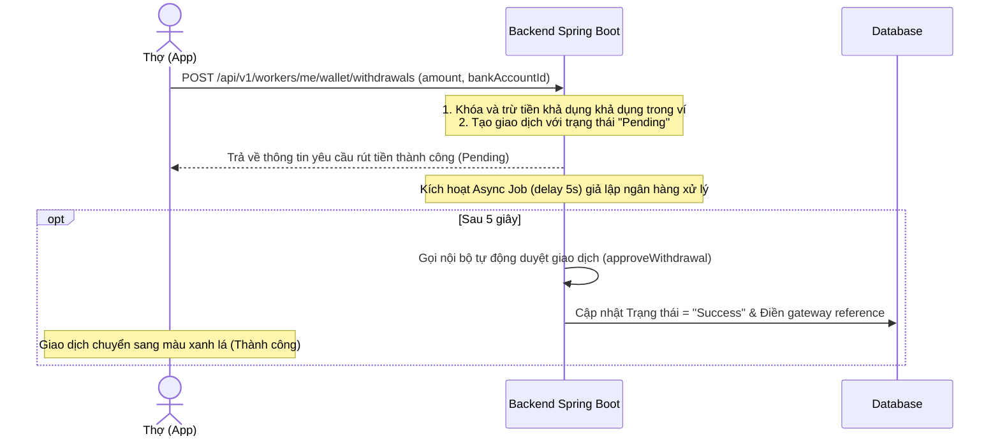

# Hướng dẫn Tích hợp Chi hộ (Payout) và Giả lập Rút tiền

Tài liệu này hướng dẫn cách hoạt động của hệ thống rút tiền giả lập (đã triển khai) và phương án tích hợp cổng thanh toán chi hộ tự động khi đưa lên môi trường Production.

---

## 1. Cơ chế hoạt động của hệ thống giả lập (Development Mode)

Hiện tại, chức năng rút tiền đã được giả lập tự động để thuận tiện cho việc phát triển và kiểm thử ở Frontend/Android app mà không cần liên kết cổng thật:



### Các Endpoint đã được triển khai:
1. **Tạo yêu cầu rút tiền**: `POST /api/v1/workers/me/wallet/withdrawals`
2. **Xem chi tiết yêu cầu**: `GET /api/v1/workers/me/wallet/withdrawals/{transactionId}`
3. **Hủy yêu cầu (nếu chưa xử lý)**: `POST /api/v1/workers/me/wallet/withdrawals/{transactionId}/cancel`
4. **Admin Duyệt (Manual)**: `POST /api/v1/admin/wallet/withdrawals/{transactionId}/approve`
5. **Admin Từ chối (Manual)**: `POST /api/v1/admin/wallet/withdrawals/{transactionId}/reject`

---

## 2. Giải pháp đưa lên Production (Chi hộ Tự động)

Vì các bên trung gian như **SePay** chỉ hỗ trợ **Thu hộ** (Pay-in/nhận tiền thông qua quét mã QR chuyển khoản), việc **Chi hộ** (Pay-out/rút tiền tự động từ tài khoản công ty chuyển khoản cho thợ) cần tích hợp qua các giải pháp sau:

### Phương án A: Sử dụng MBBank / ACB Core Banking API (Khuyên dùng)
Hầu hết các ngân hàng lớn hiện nay (MBBank, ACB, Techcombank) đều cung cấp dịch vụ **Corporate Open API** dành cho doanh nghiệp, cho phép thực hiện chuyển khoản Napas 247 thông qua API.
* **Luồng xử lý**:
  1. Thợ tạo yêu cầu rút tiền.
  2. Backend kiểm tra số dư và tạo giao dịch `Pending`.
  3. Backend gọi API chuyển khoản 247 của MBBank/ACB bằng HTTP Client (WebClient/RestTemplate) truyền vào:
     - Số tài khoản nhận (`accountNumber`)
     - Mã ngân hàng (`bankCode` / `bin`)
     - Tên người nhận (`accountName`)
     - Số tiền (`amount`)
     - Nội dung chuyển khoản (Ví dụ: `FIXIT WDR <TransactionCode>`)
  4. Nhận phản hồi tức thời từ API ngân hàng:
     - **Thành công**: Gọi `approveWithdrawal(transactionId, refCode, ...)`
     - **Thất bại**: Gọi `rejectWithdrawal(transactionId, ...)` để hoàn tiền tự động cho thợ.

### Phương án B: Sử dụng Cổng thanh toán trung gian (PayOS, ZaloPay, Casso)
Các cổng trung gian giúp đơn giản hóa việc kết nối ngân hàng qua một đầu API duy nhất:
* **PayOS Payout**: Cung cấp API tạo link rút tiền hoặc chuyển khoản trực tiếp qua ngân hàng liên kết.
* **Casso Payout**: Cung cấp SDK/API tạo lệnh chuyển tiền tự động ra từ tài khoản ngân hàng của bạn.

---

## 3. Bảo mật Webhook & Xác thực chữ ký (HMAC-SHA256)

Khi cổng thanh toán chi hộ hoàn thành giao dịch ngân hàng, họ sẽ gửi một Webhook POST về Backend của bạn để cập nhật trạng thái. Nhất thiết phải cấu hình xác thực chữ ký để tránh bị giả mạo request tấn công rút tiền khống.

### Ví dụ code cấu hình xác thực chữ ký HMAC-SHA256 trong Spring Boot:

```java
import javax.crypto.Mac;
import javax.crypto.spec.SecretKeySpec;
import java.nio.charset.StandardCharsets;
import java.security.MessageDigest;

public class SecurityUtils {

    public static boolean verifyHmacSha256(String payload, String signatureHeader, String secretKey) {
        try {
            Mac sha256Hmac = Mac.getInstance("HmacSHA256");
            SecretKeySpec secretKeySpec = new SecretKeySpec(secretKey.getBytes(StandardCharsets.UTF_8), "HmacSHA256");
            sha256Hmac.init(secretKeySpec);
            
            byte[] hashBytes = sha256Hmac.doFinal(payload.getBytes(StandardCharsets.UTF_8));
            
            // Chuyển hex string
            StringBuilder hexString = new StringBuilder();
            for (byte b : hashBytes) {
                String hex = Integer.toHexString(0xff & b);
                if (hex.length() == 1) hexString.append('0');
                hexString.append(hex);
            }
            
            String calculatedSignature = hexString.toString();
            return MessageDigest.isEqual(
                calculatedSignature.getBytes(StandardCharsets.UTF_8), 
                signatureHeader.getBytes(StandardCharsets.UTF_8)
            );
        } catch (Exception e) {
            return false;
        }
    }
}
```

### Cấu hình Endpoint nhận Webhook từ cổng Chi hộ:

```java
@RestController
@RequestMapping("/api/v1/webhooks")
public class PayoutWebhookController {

    @Value("${app.payment.payout-webhook-secret}")
    private String webhookSecret;

    private final WorkerWalletService walletService;

    @PostMapping("/payout")
    public ResponseEntity<Void> handlePayoutWebhook(
            @RequestBody String requestBody,
            @RequestHeader("X-Signature") String signature
    ) {
        // 1. Xác thực chữ ký để đảm bảo request đến từ cổng thanh toán uy tín
        boolean isValid = SecurityUtils.verifyHmacSha256(requestBody, signature, webhookSecret);
        if (!isValid) {
            return ResponseEntity.status(HttpStatus.UNAUTHORIZED).build();
        }

        // 2. Parse requestBody và lấy thông tin trạng thái giao dịch
        // Giả sử requestBody chứa transactionCode và trạng thái
        PayoutWebhookData data = parseWebhookData(requestBody);
        
        if ("SUCCESS".equalsIgnoreCase(data.getStatus())) {
            walletService.approveWithdrawal(data.getTransactionId(), data.getReferenceCode(), "Rút tiền thành công qua ngân hàng");
        } else if ("FAILED".equalsIgnoreCase(data.getStatus())) {
            walletService.rejectWithdrawal(data.getTransactionId(), "Ngân hàng từ chối: " + data.getReason());
        }

        return ResponseEntity.ok().build();
    }
}
```

---

## 4. Kiểm tra luồng Rút tiền Giả lập (Cách test)

Bạn có thể chạy thử luồng này bằng cách gửi API qua Postman:

1. **Bước 1**: Lấy danh sách tài khoản ngân hàng của thợ để lấy `targetBankAccountId`:
   * `GET /api/v1/workers/me/bank-accounts`
2. **Bước 2**: Thực hiện gửi yêu cầu rút tiền:
   * `POST /api/v1/workers/me/wallet/withdrawals`
   * Body:
     ```json
     {
       "amount": 50000,
       "targetBankAccountId": "uuid-tài-khoản-ngân-hàng"
     }
     ```
3. **Bước 3**: Gọi xem trạng thái ngay lập tức, bạn sẽ thấy trạng thái là `"Pending"`.
4. **Bước 4**: Chờ 5 giây rồi gọi lại API chi tiết giao dịch hoặc kiểm tra số dư ví. Bạn sẽ thấy trạng thái chuyển thành `"Success"`, số tiền khả dụng đã được trừ hoàn tất, chứng minh hệ thống giả lập tự động duyệt đã vận hành chính xác.
