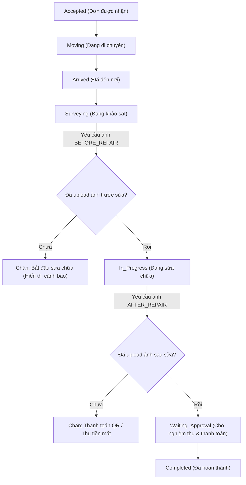

# Tài liệu Tích hợp Bằng chứng Công việc (Proof-of-Work)

Tài liệu này mô tả chi tiết cơ chế xác thực hình ảnh minh chứng trước khi sửa chữa (Before Repair) và sau khi sửa chữa (After Repair) nhằm đảm bảo tính minh bạch, chống gian lận và tối ưu hóa trải nghiệm khách hàng.

---

## 📌 Quy trình Nghiệp vụ (Workflow)

Quy trình thực hiện đơn hàng bắt buộc phải tuân thủ các bước kiểm tra hình ảnh dưới đây:



---

## 1. Triển khai phía Backend (Spring Boot)

### Bảng Cơ sở dữ liệu và Entity
Đối tượng lưu trữ thông tin minh chứng là bảng `proof_of_work` liên kết trực tiếp tới bảng `booking`.

* **Entity `ProofOfWork`**:
  * `id`: UUID (Khóa chính)
  * `booking`: Liên kết `@ManyToOne` với `Booking`
  * `imageUrl`: Đường dẫn ảnh lưu trữ trên CDN/Firebase Storage
  * `proofType`: Enum `ProofType` nhận giá trị:
    * `BEFORE_REPAIR`: Ảnh minh chứng hiện trạng hỏng hóc trước khi sửa.
    * `AFTER_REPAIR`: Ảnh thiết bị/kết quả sau khi đã sửa xong.
  * `capturedAt`: Thời điểm chụp/tải ảnh lên.

### Logic Xác thực nghiệp vụ (`WorkerBookingActionServiceImpl.java`)

Backend thực hiện kiểm tra nghiêm ngặt trước khi cập nhật trạng thái trong cơ sở dữ liệu:

1. **Trước khi chuyển sang trạng thái Đang sửa chữa (`In_Progress`)**:
   * Khi gọi hàm `startRepair(bookingId)`:
     ```java
     if (!proofOfWorkRepository.findByBooking_IdAndProofType(bookingId, ProofType.BEFORE_REPAIR).isPresent()) {
         throw new AppException(ErrorCode.PROOF_OF_WORK_BEFORE_REPAIR_REQUIRED);
     }
     ```
   * Nếu thợ chưa upload ảnh trước sửa, hệ thống sẽ ném ngoại lệ chặn thay đổi trạng thái.

2. **Trước khi chuyển sang trạng thái Chờ nghiệm thu (`Waiting_Approval`)**:
   * Khi gọi hàm `workerComplete(bookingId)` (được kích hoạt tự động sau khi xác nhận thanh toán/quét QR thành công):
     ```java
     if (!proofOfWorkRepository.findByBooking_IdAndProofType(bookingId, ProofType.AFTER_REPAIR).isPresent()) {
         throw new AppException(ErrorCode.PROOF_OF_WORK_AFTER_REPAIR_REQUIRED);
     }
     ```
   * Nếu thợ chưa upload ảnh kết quả sau sửa, hệ thống chặn việc hoàn thành công việc.

---

## 2. Triển khai phía Android Client

Ứng dụng thợ (Worker App) áp dụng cơ chế xác thực cả ở phía giao diện (Client-side validation) để tối ưu hóa UX, tránh việc thợ gửi yêu cầu API lên server rồi mới nhận báo lỗi.

### Hiển thị và Binding dữ liệu (`OrderDetailUiHelper.java`)
Giao diện chi tiết đơn hàng hiển thị 2 khung hình ảnh cho bằng chứng trước và sau. 

* Hàm `bindOrderData` đọc thông tin hình ảnh từ `WorkerOrder`:
  ```java
  public void bindOrderData(WorkerOrder order) {
      this.currentOrder = order;
      // ...
      if (order.getProofBeforeUrl() != null && !order.getProofBeforeUrl().isEmpty()) {
          displayProofBeforeImage(order.getProofBeforeUrl());
      }
      if (order.getProofAfterUrl() != null && !order.getProofAfterUrl().isEmpty()) {
          displayProofAfterImage(order.getProofAfterUrl());
      }
  }
  ```
* Nếu ảnh đã được tải lên trước đó, Glide sẽ tải ảnh trực tiếp từ URL và hiển thị đè lên khung chụp mặc định, kèm theo tick xanh báo hiệu hoàn thành.

### Ràng buộc Client-Side

1. **Chặn chuyển đổi từ Khảo sát sang Sửa chữa (`SURVEYING` -> `REPAIRING`)**:
   * Xử lý trong sự kiện click của `btnCompleteOrderDetail` (nút hành động chính):
     ```java
     binding.btnCompleteOrderDetail.setOnClickListener(v -> {
         WorkerOrder order = fragment.getCurrentOrder();
         if (order != null) {
             JobStatus currentStatus = viewModel.currentStatus.getValue();
             if (currentStatus == JobStatus.SURVEYING) {
                 if (order.getProofBeforeUrl() == null || order.getProofBeforeUrl().isEmpty()) {
                     Toast.makeText(fragment.requireContext(),
                             "Bạn phải tải lên ảnh bằng chứng TRƯỚC khi sửa chữa!",
                             Toast.LENGTH_LONG).show();
                     return; // Ngăn chặn hiển thị AlertDialog và gọi API
                 }
             }
             // ... tiến hành xác nhận và gọi API
         }
     });
     ```

2. **Chặn kích hoạt Thanh toán QR & Tiền mặt (`REPAIRING` -> `WAITING_APPROVAL`)**:
   * Xử lý trong `OrderPaymentHelper.java` tại 2 hàm `showPaymentQrCode` và `confirmCashPayment`:
     ```java
     public void showPaymentQrCode(WorkerOrder currentOrder) {
         if (currentOrder.getProofAfterUrl() == null || currentOrder.getProofAfterUrl().isEmpty()) {
             Toast.makeText(fragment.requireContext(),
                     "Bạn phải tải lên ảnh bằng chứng SAU khi sửa chữa trước khi thanh toán và hoàn thành!",
                     Toast.LENGTH_LONG).show();
             return; // Chặn tạo mã QR
         }
         // ... tạo QR
     }
     ```

### Cơ chế Upload ảnh và Tự động Tải lại (Auto-refresh)
* Lớp `WorkerOrderDetailFragment.java` đăng ký bộ chọn tập tin ảnh (`pickBeforeImageLauncher` và `pickAfterImageLauncher`) gửi yêu cầu tới `UploadViewModel` để đẩy ảnh lên server:
  ```java
  uploadViewModel.upload(
      requireContext(),
      uri,
      UploadPurpose.PROOF_BEFORE_REPAIR, // hoặc PROOF_AFTER_REPAIR
      UploadTargetType.PROOF_OF_WORK,
      getCurrentOrderId(),
      ...
  );
  ```
* Lắng nghe kết quả tải lên thành công:
  ```java
  uploadViewModel.getUploadResult().observe(getViewLifecycleOwner(), result -> {
      if (result instanceof UploadResult.Success) {
          // Làm mới chi tiết đơn hàng từ server để lấy URL ảnh vừa lưu
          viewModel.loadOrderDetails(getCurrentOrderId(), false);
      }
  });
  ```
* Việc làm mới dữ liệu đơn hàng sẽ cập nhật thuộc tính `proofBeforeUrl` / `proofAfterUrl` bên trong `WorkerOrder`, gỡ bỏ các chốt chặn điều kiện ở client giúp thợ thực hiện tiếp các bước chuyển trạng thái hoặc thanh toán.

---

## 3. Lịch sử thay đổi và Các file liên quan

### Backend
* [ProofOfWorkController.java](file:///f:/Project_personal/FixItVN/backend/src/main/java/com/fixit/domain/booking/controller/ProofOfWorkController.java) - API upload ảnh bằng chứng.
* [ProofOfWorkServiceImpl.java](file:///f:/Project_personal/FixItVN/backend/src/main/java/com/fixit/domain/booking/service/ProofOfWorkServiceImpl.java) - Lưu trữ cơ sở dữ liệu `proof_of_work`.
* [WorkerBookingActionServiceImpl.java](file:///f:/Project_personal/FixItVN/backend/src/main/java/com/fixit/domain/booking/service/WorkerBookingActionServiceImpl.java) - Xác thực nghiệp vụ trước khi chuyển trạng thái.

### Android
* [OrderDetailUiHelper.java](file:///f:/Project_personal/FixItVN/android/app/src/main/java/com/fixit/feature/worker/orders/presentation/detail/OrderDetailUiHelper.java) - Giao diện hiển thị, chốt chặn ảnh trước sửa.
* [OrderPaymentHelper.java](file:///f:/Project_personal/FixItVN/android/app/src/main/java/com/fixit/feature/worker/orders/presentation/detail/OrderPaymentHelper.java) - Chốt chặn ảnh sau sửa tại các cổng thanh toán.
* [WorkerOrderDetailFragment.java](file:///f:/Project_personal/FixItVN/android/app/src/main/java/com/fixit/feature/worker/orders/presentation/detail/WorkerOrderDetailFragment.java) - Điều phối camera, nhận ảnh và kích hoạt refresh.
