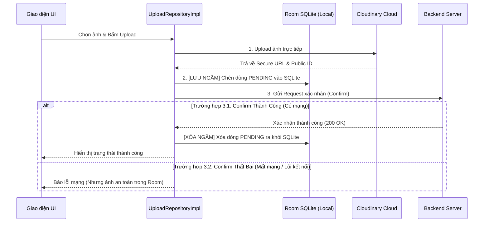

# Hướng Dẫn Vận Hành & Quản Lý Room Database (Offline Upload Queue)

Chào bạn! Tài liệu này sẽ giúp bạn hiểu rõ cấu trúc của **Room Database** vừa được triển khai cho tính năng Upload, cách thức vận hành (cách chạy) hệ thống tự động retry ngoại tuyến, và đặc biệt là cách sử dụng các công cụ trong **Android Studio** để theo dõi, chỉnh sửa dữ liệu SQLite trực quan trong quá trình lập trình.

---

## 1. Cấu Trúc Room Database Trong Dự Án

Cơ chế Room vừa được triển khai đóng gói hoàn toàn trong phân hệ `upload`:
* **Entity (`PendingUploadConfirmEntity`):** Đại diện cho bảng `pending_upload_confirms` trong SQLite local.
* **DAO (`PendingUploadConfirmDao`):** Chứa các hàm truy vấn SQL: `insert`, `deleteByUploadId` (xóa khi confirm thành công), và `getAllPending` (lấy danh sách hàng đợi theo kiểu FIFO - thời gian cũ nhất lên trước).
* **Database (`UploadDatabase`):** Quản lý kết nối SQLite cục bộ với tên file database vật lý là `"upload_db"`.
* **DI Hilt (`UploadModule`):** Tự động cung cấp cơ sở dữ liệu singleton cho toàn bộ ứng dụng.

---

## 2. Cách Thức Vận Hành & Cách Chạy (How to Run & Trigger Retry)

Hệ thống hoạt động hoàn toàn tự động dựa trên luồng đi 3 bước bảo mật của chúng ta:



### 💡 Cách kích hoạt gửi lại các ảnh bị kẹt (Retry Trigger):
Trong mã nguồn `UploadRepositoryImpl.java`, phương thức `retryPendingConfirm(ResultCallback<ConfirmedUpload> callback)` đã được viết lại để lấy tệp tin cũ nhất trong Room DB và thực hiện gửi lại lệnh confirm:

* **Trigger thủ công qua UI:** Bạn có thể gọi `uploadRepository.retryPendingConfirm(...)` khi người dùng bấm vào nút "Thử lại" trên giao diện khi mạng khỏe.
* **Tự động chạy ngầm:** Để tự động hóa hoàn toàn khi có mạng lại, bạn có thể triển khai `WorkManager` (đăng ký lắng nghe sự kiện `NetworkType.CONNECTED`) hoặc kích hoạt hàm `retryPendingConfirm` ngay khi mở ứng dụng ở màn hình Splash/Home để đẩy hết các ảnh đang bị kẹt lên Backend.

---

## 3. Cách Xem & Quản Lý Dữ Liệu SQLite Trực Quan (App Inspection)

Để xem các ảnh đang bị kẹt trong Room, bạn không cần phải tải các app đọc file SQLite thủ công nữa. **Android Studio** cung cấp một công cụ tuyệt vời tên là **App Inspection** giúp bạn theo dõi dữ liệu live ngay trên Emulator hoặc Thiết bị thật.

### 🛠️ Các bước thực hiện chi tiết:

1. **Khởi chạy ứng dụng:** 
   * Cắm thiết bị Android của bạn vào máy tính hoặc mở Emulator.
   * Nhấn nút **Run** (hình tam giác xanh) trong Android Studio để khởi chạy ứng dụng `FixItVN`.

2. **Mở tab App Inspection:**
   * Nhìn xuống thanh công cụ phía dưới cùng của Android Studio, tìm và click vào tab **`App Inspection`** (nếu không thấy, bạn có thể vào menu: **View** $\rightarrow$ **Tool Windows** $\rightarrow$ **App Inspection**).

3. **Chọn Thiết bị & Tiến trình (Process):**
   * Trong cửa sổ *App Inspection*, chọn đúng tên thiết bị của bạn và tiến trình ứng dụng là `com.fixit.vn`.

4. **Xem Live Database (Database Inspector):**
   * Click chọn tab **`Database Inspector`** trong cửa sổ App Inspection.
   * Bạn sẽ nhìn thấy cơ sở dữ liệu có tên là **`upload_db`** hiển thị ở cột bên trái dưới dạng cấu trúc cây.
   * Click đúp (Double-click) vào bảng **`pending_upload_confirms`**.

5. **Theo dõi và Thao tác Live:**
   * **Xem dữ liệu:** Cửa sổ bên phải sẽ hiển thị danh sách toàn bộ các hàng dữ liệu (rows) bao gồm `uploadId`, `fileUrl`, `createdAt`... tương ứng với các ảnh đang chờ retry.
   * **Xem Live Update:** Khi bạn tắt mạng trên điện thoại $\rightarrow$ tiến hành chọn ảnh và upload $\rightarrow$ bạn sẽ thấy 1 dòng mới lập tức xuất hiện trong bảng này. Khi bạn bật mạng lại $\rightarrow$ bấm retry thành công $\rightarrow$ dòng đó lập tức biến mất!
   * **Tự viết câu lệnh SQL để Test:** Bạn có thể click vào nút **`Open New Query Tab`** (biểu tượng bảng kèm dấu chớp) ở góc trên để tự viết lệnh SQL tùy chỉnh, ví dụ:
     ```sql
     SELECT * FROM pending_upload_confirms WHERE retryCount > 0;
     ```
   * **Chỉnh sửa dữ liệu Live:** Bạn có thể click đúp chuột trực tiếp vào bất kỳ ô giá trị nào trên bảng (ví dụ thay đổi giá trị `retryCount` hoặc sửa link ảnh `fileUrl`) để giả lập dữ liệu lỗi và test độ bền bỉ của code retry!

---

## 4. Kiểm Chứng & Độ Tin Cậy Của Mã Nguồn

Chúng ta đã kiểm tra biên dịch thành công toàn bộ hệ thống Room mới này:
* **Lệnh kiểm tra:** `./gradlew assembleDebug`
* **Kết quả:** **`BUILD SUCCESSFUL`** (Mọi annotation-processor của Room và Hilt tạo code tự động đều khớp 100%).

Tài liệu này giúp bạn hoàn toàn làm chủ cơ chế lưu trữ của ứng dụng. Hãy tự tin trải nghiệm sức mạnh vượt trội của Room Database nhé!
